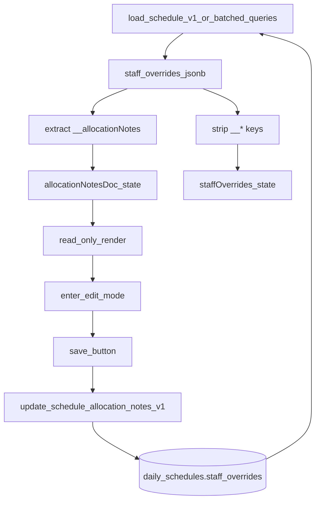

## Visual draft (placement + states)

- **Where**: directly **below** `PCA Dedicated Schedule` table (Block 6 area) on the schedule page, inside the same right-side content column.
- **Width**: aligns with the 8-team grid (FO left edge → DRO right edge).

Display mode:

- Header row: **“Points to note”** (left) + **pencil icon** (right)
- Body: rendered rich text (bold/italic/underline/colors/highlight/lists/indent)

Edit mode:

- Toolbar row (Word/Google-doc basics):
  - Bold / Italic / Underline
  - Text color (popover: 10 swatches in 2 rows)
  - Highlight (popover: 10 swatches in 2 rows)
  - Bullets / Numbering
  - Indent / Outdent
- Editor area:
  - Expands with content up to **15 lines**; beyond that becomes **scrollable**
- Buttons (regular button style): **Save** (persists to DB immediately) + **Cancel**

---

## Data model + persistence

- Store note under `daily_schedules.staff_overrides.__allocationNotes`:
  - `{ doc: <rich_text_json>, updatedAt: <ISO string> }`
- **Roll-over behavior** (confirmed): when a schedule row is first created for a date, seed `__allocationNotes` from the **previous working day’s** saved note (if present).
- **Immediate persistence** (confirmed): clicking **Save** in the note board writes to DB right away.

---

## Implementation approach

### 1) Types

- Update [`/Users/alvin/Desktop/RBIP duty list web app/types/schedule.ts`](/Users/alvin/Desktop/RBIP duty list web app/types/schedule.ts)(/Users/alvin/Desktop/RBIP duty list web app/types/schedule.ts)(/Users/alvin/Desktop/RBIP duty list web app/types/schedule.ts)(/Users/alvin/Desktop/RBIP duty list web app/types/schedule.ts)(/Users/alvin/Desktop/RBIP duty list web app/types/schedule.ts)(/Users/alvin/Desktop/RBIP duty list web app/types/schedule.ts)(/Users/alvin/Desktop/RBIP duty list web app/types/schedule.ts)
  - Add a small type for this metadata (keep editor-agnostic):
    - `AllocationNotesPayload = { doc: unknown; updatedAt?: string }`

### 2) UI component (rich text)

- Add new component: [`/Users/alvin/Desktop/RBIP duty list web app/components/allocation/AllocationNotesBoard.tsx`](/Users/alvin/Desktop/RBIP duty list web app/components/allocation/AllocationNotesBoard.tsx)(/Users/alvin/Desktop/RBIP duty list web app/components/allocation/AllocationNotesBoard.tsx)(/Users/alvin/Desktop/RBIP duty list web app/components/allocation/AllocationNotesBoard.tsx)(/Users/alvin/Desktop/RBIP duty list web app/components/allocation/AllocationNotesBoard.tsx)(/Users/alvin/Desktop/RBIP duty list web app/components/allocation/AllocationNotesBoard.tsx)(/Users/alvin/Desktop/RBIP duty list web app/components/allocation/AllocationNotesBoard.tsx)(/Users/alvin/Desktop/RBIP duty list web app/components/allocation/AllocationNotesBoard.tsx)
  - Use **Tiptap** with JSON doc as source of truth.
  - Provide toolbar actions for:
    - bold/italic/underline
    - text color + highlight color (Radix popover grid)
    - bullet/ordered lists
    - indent/outdent (list item sink/lift)
  - Display mode renders doc read-only.
  - Edit mode enforces max-height ≈ 15 lines and scrolls after.

### 3) DB write path (partial JSONB update)

- Add a migration to create an RPC that patches only the note inside `staff_overrides` (so we don’t accidentally persist other unsaved overrides):
  - New migration file: `supabase/migrations/add_update_allocation_notes_rpc.sql`
  - Function sketch:
    - `update_schedule_allocation_notes_v1(p_schedule_id uuid, p_doc jsonb, p_updated_at timestamptz)`
    - Uses `jsonb_set(COALESCE(staff_overrides,'{}'), '{__allocationNotes}', ...)`.

### 4) Schedule page integration

- Update [`/Users/alvin/Desktop/RBIP duty list web app/app/(dashboard)/schedule/page.tsx`](/Users/alvin/Desktop/RBIP duty list web app/app/\(dashboard\)/schedule/page.tsx)(/Users/alvin/Desktop/RBIP duty list web app/app/\(dashboard\)/schedule/page.tsx)(/Users/alvin/Desktop/RBIP duty list web app/app/\(dashboard\)/schedule/page.tsx)(/Users/alvin/Desktop/RBIP duty list web app/app/\(dashboard\)/schedule/page.tsx)(/Users/alvin/Desktop/RBIP duty list web app/app/\(dashboard\)/schedule/page.tsx)(/Users/alvin/Desktop/RBIP duty list web app/app/\(dashboard\)/schedule/page.tsx)(/Users/alvin/Desktop/RBIP duty list web app/app/(dashboard)/schedule/page.tsx)
  - Add state:
    - `allocationNotesDoc` (current)
    - `savedAllocationNotesDoc` (last loaded/saved)
  - **Load**:
    - When parsing persisted `staff_overrides`, extract `(staff_overrides as any).__allocationNotes` into the note state, then `delete __allocationNotes` before calling `setStaffOverrides(...)`.
  - **Create schedule row**:
    - When inserting a new `daily_schedules` row, query previous working day’s schedule and seed its `__allocationNotes` into the new row’s `staff_overrides`.
  - **Render**:
    - Place `<AllocationNotesBoard />` immediately after `<PCADedicatedScheduleTable />` in a `grid grid-cols-8` wrapper with `col-span-8`.
  - **Save behavior**:
    - Board Save calls the new RPC to persist note immediately.
    - Main “Save schedule” also includes `__allocationNotes` in `staffOverridesPayloadForDb` to prevent drift.
  - **Reset to baseline**:
    - Clear the note state too.

### 5) Fast load + caching

- Update cache shape in [`/Users/alvin/Desktop/RBIP duty list web app/lib/utils/scheduleCache.ts`](/Users/alvin/Desktop/RBIP duty list web app/lib/utils/scheduleCache.ts)(/Users/alvin/Desktop/RBIP duty list web app/lib/utils/scheduleCache.ts)(/Users/alvin/Desktop/RBIP duty list web app/lib/utils/scheduleCache.ts)(/Users/alvin/Desktop/RBIP duty list web app/lib/utils/scheduleCache.ts)(/Users/alvin/Desktop/RBIP duty list web app/lib/utils/scheduleCache.ts)(/Users/alvin/Desktop/RBIP duty list web app/lib/utils/scheduleCache.ts)(/Users/alvin/Desktop/RBIP duty list web app/lib/utils/scheduleCache.ts)
  - Include `allocationNotesDoc` (and apply it on cache hits).
  - While touching cache, also cache/apply existing schedule-level metadata already extracted from `staff_overrides` (like `__bedCounts`, `__bedRelieving`) so cached navigation stays correct.

### 6) Copy integration

- No special handling needed: Copy already copies `staff_overrides` (and only strips `__bedRelieving`). `__allocationNotes` will be copied automatically in both RPC and fallback paths.

---

## Data flow diagram

