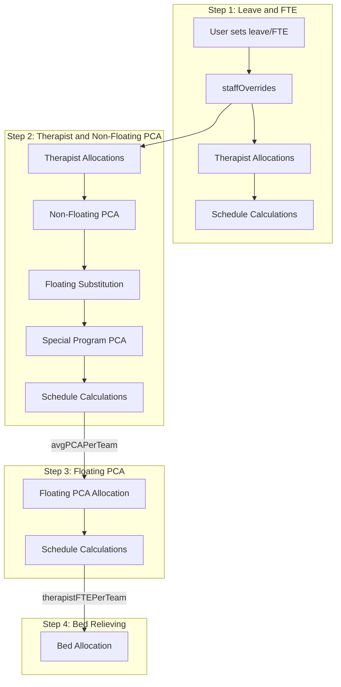
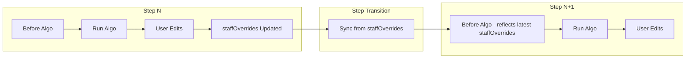
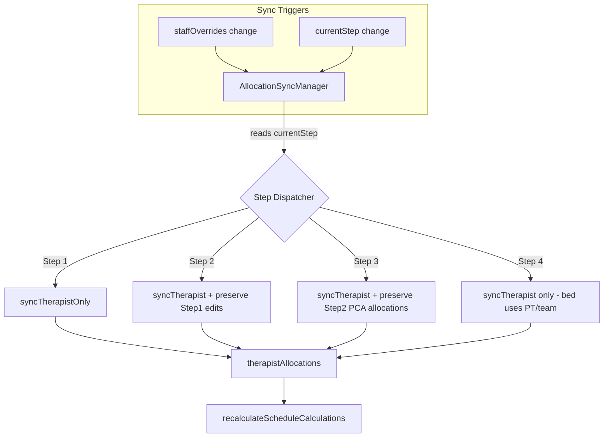

# Allocation Sync Optimization Plan

## Problem Analysis

The current architecture has scattered allocation update logic:

- 12 places calling `setTherapistAllocations` or `setPcaAllocations`
- Multiple `useEffect` hooks with inconsistent step conditions
- No guarantee that allocations reflect `staffOverrides` after user edits

## Step-Wise Allocation Dependencies



## Proposed Sync Architecture

### Core Principle: staffOverrides is the Single Source of Truth



### Two Sync Triggers

1. **On staffOverrides change** (within a step): Real-time UI sync
2. **On step transition** (currentStep changes): Full sync to populate "before algo" state



## Key Design Decisions

### PCA Allocation by Step

| Step | PCA Types Handled | Sync Behavior on staffOverrides Change ||------|-------------------|----------------------------------------|| Step 1 | None | Only sync therapist allocations || Step 2 | Non-floating, Substitution, Special Program | Sync therapist; PCA algo runs on button click || Step 3 | Floating (tie-breaker) | Sync therapist; preserve existing PCA allocations || Step 4 | None | Sync therapist only (bed depends on PT/team) |

### What Each Algo Reads from staffOverrides

| Step | Algo | Reads from staffOverrides ||------|------|--------------------------|| Step 2 | `generateAllocationsWithOverrides()` | `team`, `fteRemaining`, `leaveType`, `availableSlots` || Step 3 | `allocatePCA(phase='floating')` | Uses `existingAllocations` from Step 2 + remaining FTE from `staffOverrides` || Step 4 | `allocateBeds()` | Uses `scheduleCalculations.ptPerTeam` (derived from therapist allocations) |

### Cross-Step Dependencies

1. **Therapist allocations** affect all subsequent steps (PT/team calculation)
2. **Step 2 PCA allocations** (non-floating, substitution) are preserved in Step 3
3. **Step 4** depends on `sum of therapist-FTE/team` from `scheduleCalculations`

### pendingPCA-FTE/team Calculation for Step 3

The floating PCA algorithm needs to know how much PCA demand remains per team:

```javascript
pendingPCA-FTE/team = avgPCAPerTeam - (non-floating PCA FTE already allocated to team)
```

**Important distinctions:**

- **Non-floating PCA** allocations from Step 2 -> **REDUCE** pendingPCA-FTE/team
- **Floating PCA substituting non-floating** -> **REDUCE** pendingPCA-FTE/team (filling the same role)
- **Special program PCA** allocations -> do **NOT** reduce pendingPCA-FTE/team (they serve special programs, not general team support)

This is calculated by `recalculateFromCurrentState()` which iterates through `pcaAllocations` and sums up team-specific slot assignments.

### Step Transition Data Flow

| Transition | What Carries Forward | What Gets Fed to Next Algo ||------------|---------------------|---------------------------|| Step 1 -> Step 2 | `staffOverrides` (leave/FTE/team) | Therapist algo uses latest `staffOverrides`; PCA algo uses therapist result || Step 2 -> Step 3 | `staffOverrides` + Step 2 PCA allocations | Floating algo receives Step 2 allocations as `existingAllocations` || Step 3 -> Step 4 | `staffOverrides` + all PCA allocations | Bed algo uses `scheduleCalculations.ptPerTeam` (derived from therapist FTE) |**Critical Rule**: At each step transition, the sync hook:

1. Reads the **latest** `staffOverrides` (accumulated from all previous steps)
2. Rebuilds `therapistAllocations` to reflect any team/FTE changes
3. Preserves existing PCA allocations (they are only modified by their respective algo)
4. Updates `scheduleCalculations` so next step has accurate PT/team and avgPCA/team

## Implementation

### 1. Create Custom Hook: `useAllocationSync`

Create [`lib/hooks/useAllocationSync.ts`](lib/hooks/useAllocationSync.ts):

```typescript
export function useAllocationSync(deps: AllocationSyncDeps) {
  const { staffOverrides, currentStep, ... } = deps
  const prevStepRef = useRef(currentStep)
  const prevOverridesRef = useRef(staffOverrides)
  
  // Step-aware sync dispatcher
  const syncAllocations = useCallback(() => {
    switch (currentStep) {
      case 'leave-fte':
        // Step 1: Only therapist + calculations
        syncTherapistAllocations()
        break
      case 'therapist-pca':
        // Step 2: Therapist allocations synced; PCA algo runs on button click
        syncTherapistAllocations()
        break
      case 'floating-pca':
        // Step 3: Therapist synced; Step 2 PCA allocations preserved
        syncTherapistAllocations()
        break
      case 'bed-relieving':
        // Step 4: Therapist synced; bed allocation uses PT/team from calculations
        syncTherapistAllocations()
        break
    }
    recalculateScheduleCalculations()
  }, [currentStep, ...])

  // TRIGGER 1: Sync on staffOverrides change (real-time within step)
  useEffect(() => {
    if (!hasRelevantChanges(staffOverrides, prevOverridesRef.current)) return
    syncAllocations()
    prevOverridesRef.current = staffOverrides
  }, [staffOverrides, syncAllocations])

  // TRIGGER 2: Sync on step transition (populate "before algo" state)
  useEffect(() => {
    if (currentStep === prevStepRef.current) return
    // Step changed - sync allocations from latest staffOverrides
    console.log(`Step transition: ${prevStepRef.current} -> ${currentStep}`)
    syncAllocations()
    prevStepRef.current = currentStep
  }, [currentStep, syncAllocations])

  return { syncAllocations, syncTherapistAllocations }
}
```

### 2. Change Detection Helper

```typescript
function detectChanges(current: StaffOverrides, previous: StaffOverrides) {
  return {
    hasTeamChange: /* ... */,
    hasFTEChange: /* ... */,
    hasLeaveChange: /* ... */,
    hasSlotChange: /* ... */,
  }
}
```

### 3. Update Schedule Page

Modify [`app/(dashboard)/schedule/page.tsx`](app/\\\\\\\\\\\\\\\\\\\\\\\\\\\\\(dashboard)/schedule/page.tsx):

- Import and use `useAllocationSync` hook
- Remove scattered `useEffect` hooks
- Simplify drag-and-drop handler

### 4. Update Project Rules

Update [`.cursor/rules/stepwise-workflow-data.mdc`](.cursor/rules/stepwise-workflow-data.mdc) to document: