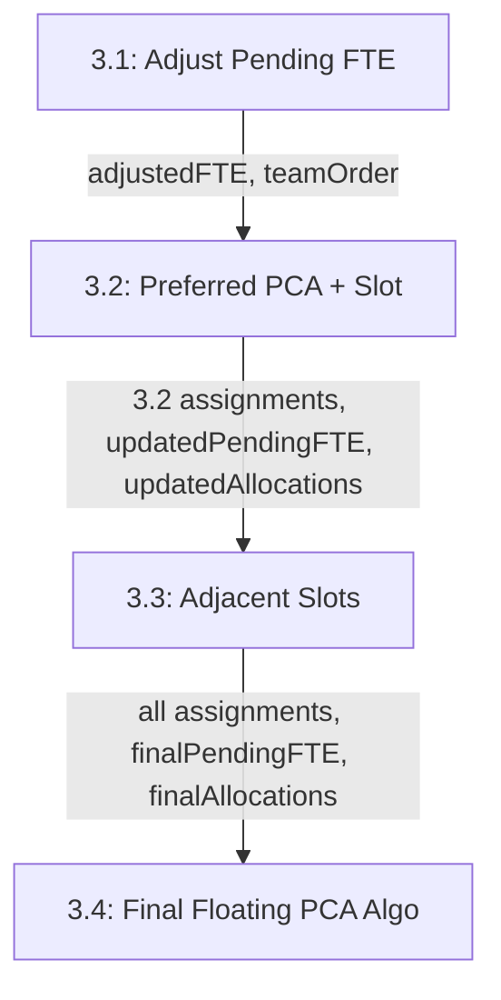

# Implement Step 3.3: Adjacent Slot Assignment from Special Program PCAs

## Summary

Step 3.3 identifies PCAs assigned to teams via special programs in Step 2 and checks if their **adjacent slots** (1<->2, 3<->4) are available. If the team's pending FTE > 0 and the adjacent slot is available, the user can choose to assign it.

## Data Flow




### Key Data Structures

| Data | Source | Description ||------|--------|-------------|| `expectedFTE` | Step 3.1 | **Constant** - Original adjusted rounded pending FTE (for display reference) || `currentPendingFTE` | Updated in 3.2/3.3 | Team's remaining pending FTE after assignments || `assignedFTE` | Calculated | `expectedFTE - currentPendingFTE` || `existingAllocations` | Step 2 + 3.2 | Allocations with slot assignments || `step32Assignments` | Step 3.2 | Slots assigned in 3.2 (shown in gray in 3.3) |---

## Implementation Plan

### 1. Update Type Definition for MiniStep

**File:** [`components/allocation/FloatingPCAConfigDialog.tsx`](components/allocation/FloatingPCAConfigDialog.tsx)

```typescript
type MiniStep = '3.1' | '3.2' | '3.3'
```

---

### 2. Add Adjacent Slot Computation Logic

**File:** [`lib/utils/reservationLogic.ts`](lib/utils/reservationLogic.ts)Create new function `computeAdjacentSlotReservations()`:

```typescript
// Adjacent slot mapping
const ADJACENT_SLOTS: Record<number, number> = {
  1: 2, 2: 1, 3: 4, 4: 3
}

export interface AdjacentSlotInfo {
  pcaId: string
  pcaName: string
  specialProgramSlot: number  // The slot assigned by special program
  adjacentSlot: number        // The adjacent slot to potentially assign
  team: Team                  // Team that has this special program
}

export interface AdjacentSlotReservations {
  [team: Team]: AdjacentSlotInfo[]  // Multiple PCAs per team possible
}

export function computeAdjacentSlotReservations(
  currentPendingFTE: Record<Team, number>,
  existingAllocations: PCAAllocation[],
  floatingPCAs: PCAData[]
): { 
  adjacentReservations: AdjacentSlotReservations
  hasAnyAdjacentReservations: boolean 
}
```

**Logic:**

1. Find allocations where `special_program_ids` is not empty (assigned via special program)
2. For each such allocation, identify which slots are assigned to which team
3. For each assigned slot, compute the adjacent slot (1<->2, 3<->4)
4. Check if:

- The team's `currentPendingFTE > 0`
- The adjacent slot is NOT already assigned in `existingAllocations`
- The PCA still has FTE remaining

5. If all conditions met, add to `adjacentReservations[team]`

---

### 3. Update FloatingPCAConfigDialog State

**File:** [`components/allocation/FloatingPCAConfigDialog.tsx`](components/allocation/FloatingPCAConfigDialog.tsx)Add new state variables:

```typescript
// Step 3.2 completed assignments (to show in gray in 3.3)
const [step32Assignments, setStep32Assignments] = useState<SlotAssignment[]>([])

// Step 3.3 adjacent slot reservations
const [adjacentReservations, setAdjacentReservations] = useState<AdjacentSlotReservations | null>(null)

// Step 3.3 user selections
const [step33Selections, setStep33Selections] = useState<SlotAssignment[]>([])

// "Expected" FTE - constant reference from 3.1 (renamed for clarity)
const [expectedFTE, setExpectedFTE] = useState<Record<Team, number>>({} as Record<Team, number>)

// Current pending FTE - updated after each assignment
const [currentPendingFTE, setCurrentPendingFTE] = useState<Record<Team, number>>({} as Record<Team, number>)
```

---

### 4. Update Step Transition Logic

**3.1 -> 3.2:** (existing)**3.2 -> 3.3:** (new)

```typescript
const handleProceedToStep33 = () => {
  // Save 3.2 assignments
  setStep32Assignments(slotSelections)
  
  // Execute 3.2 assignments to get updated state
  const result = executeSlotAssignments(
    slotSelections,
    currentPendingFTE,
    existingAllocations,
    floatingPCAs
  )
  
  // Update state with 3.2 results
  setCurrentPendingFTE(result.updatedPendingFTE)
  setExistingAllocations(result.updatedAllocations)
  
  // Compute adjacent slot reservations
  const adjacent = computeAdjacentSlotReservations(
    result.updatedPendingFTE,
    result.updatedAllocations,
    floatingPCAs
  )
  
  setAdjacentReservations(adjacent.adjacentReservations)
  
  // Skip 3.3 if no adjacent slots available
  if (!adjacent.hasAnyAdjacentReservations) {
    onSave(expectedFTE, teamOrder, [...slotSelections])
  } else {
    setCurrentMiniStep('3.3')
  }
}
```

---

### 5. Create Step 3.3 UI Component

**File:** [`components/allocation/TeamAdjacentSlotCard.tsx`](components/allocation/TeamAdjacentSlotCard.tsx) (new file)Similar to `TeamReservationCard` but shows:

- Team name
- Expected: X.XX (constant from 3.1)
- Assigned: Y.YY (calculated)
- Separator
- **Gray text for 3.2 assigned slots** (if any): "1500-1630: 君" 
- **Checkboxes for 3.3 adjacent slots**: "[checkbox] 0900-1030: 君"

---

### 6. Update Dialog to Render Step 3.3

**File:** [`components/allocation/FloatingPCAConfigDialog.tsx`](components/allocation/FloatingPCAConfigDialog.tsx)

```typescript
const renderStep33 = () => (
  <>
    <DialogDescription>
      Assign adjacent slots from special program PCAs to the same team.
      <br />
      <span className="text-xs mt-1 block">
        Gray items show slots already assigned in Step 3.2.
      </span>
    </DialogDescription>
    
    {/* Team cards with adjacent slot options */}
    <div className="flex flex-nowrap gap-1.5 justify-center items-center overflow-x-auto">
      {teamOrder.map((team) => (
        <TeamAdjacentSlotCard
          key={team}
          team={team}
          expectedFTE={expectedFTE[team]}
          currentPendingFTE={currentPendingFTE[team]}
          step32Assignments={step32Assignments.filter(a => a.team === team)}
          adjacentSlots={adjacentReservations?.[team] || []}
          selections={step33Selections}
          onSelectionChange={handleStep33SelectionChange}
        />
      ))}
    </div>
    
    <DialogFooter>
      <Button variant="outline" onClick={handleBackToStep32}>
        Back to 3.2
      </Button>
      <Button onClick={handleFinalSave}>
        Complete Configuration
      </Button>
    </DialogFooter>
  </>
)
```

---

### 7. Update Step Indicator

```typescript
<div className="flex items-center justify-center gap-2 text-sm text-muted-foreground mb-2">
  <span className={currentMiniStep === '3.1' ? 'font-bold text-primary' : ''}>3.1 Adjust</span>
  <ChevronRight />
  <span className={currentMiniStep === '3.2' ? 'font-bold text-primary' : ''}>3.2 Preferred</span>
  <ChevronRight />
  <span className={currentMiniStep === '3.3' ? 'font-bold text-primary' : ''}>3.3 Adjacent</span>
</div>
```

---

### 8. Update onSave to Include All Assignments

Combine `step32Assignments` and `step33Selections` when calling `onSave`:

```typescript
const handleFinalSave = () => {
  const allAssignments = [...step32Assignments, ...step33Selections]
  onSave(expectedFTE, teamOrder, allAssignments)
}
```

---

## Skip Conditions for Step 3.3

Skip to final save if:

1. No teams with special program assignments have `currentPendingFTE > 0`, OR