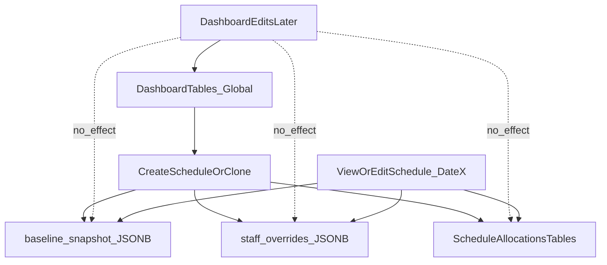

# Per-date Snapshot + Clone Modes Plan

## Goals

- **No cross-date contamination**: viewing/editing an old schedule should not change when dashboard/staff/team/wards/special-program configs change later.
- **Two user-selectable copy modes** when creating a new date from an existing one:
- **Full clone**: copy everything (Step 1–4 outputs + tie-break state).
- **Hybrid clone**: keep **Step 1 inputs + Step 2 outputs** (therapists + non-floating PCA + special-program PCA + substitutions) and reset Step 3+.

## Current-state findings (why contamination happens)

- **Dashboard tables are global** (staff roster, team assignment, wards, special program config, SPT config, etc.), so later edits affect any date that re-reads these tables.
- The current “clone schedule” endpoint clones allocations only:
```6:97:app/api/schedules/clone/route.ts
export async function POST(request: NextRequest) {
  // ...
  // Clone allocations
  const { data: therapistAllocations } = await supabase
    .from('schedule_therapist_allocations')
    .select('*')
    .eq('schedule_id', fromSchedule.id)

  // ... also clones PCA + bed allocations
}
```

- `staffOverrides` is **not stored as a first-class per-schedule record**; the schedule page reconstructs “overrides” from saved allocations, which cannot represent many Step 1/2 user inputs (e.g., `availableSlots`, `invalidSlots[]`, `specialProgramOverrides`, `substitutionFor`, etc.):
```844:938:app/(dashboard)/schedule/page.tsx
// Load schedule for date and restore saved overrides
const loadScheduleForDate = async (date: Date) => {
  // ...
  // Load therapist allocations
  const { data: therapistAllocs } = await supabase
    .from('schedule_therapist_allocations')
    .select('*')
    .eq('schedule_id', scheduleId)

  // Load PCA allocations
  const { data: pcaAllocs } = await supabase
    .from('schedule_pca_allocations')
    .select('*')
    .eq('schedule_id', scheduleId)

  // Build overrides from saved allocations
  const overrides: Record<string, { leaveType: LeaveType | null; fteRemaining: number; ... }> = {}

  therapistAllocs?.forEach(alloc => {
    if (alloc.leave_type !== null || alloc.fte_therapist !== 1) {
      const leaveType = fromDbLeaveType(alloc.leave_type as any, fte, alloc.manual_override_note)
      overrides[alloc.staff_id] = { leaveType, fteRemaining: fte }
    }
  })
}
```

- **Buffer staff risk**: buffer staff is a normal `staff` row with `status='buffer'`, and can later be changed to `inactive`. When that happens, old schedules that rely on “current staff list” can lose the ability to render that person. (This is exactly the “yesterday buffer staff disappears” problem.)
- **Repo schema note**: `supabase/schema.sql` appears older than the actual running schema (new features are in `supabase/migrations/*`). For planning, treat migrations as canonical.

## Target data architecture (snapshot-per-schedule)

We’ll separate data into three layers **per schedule date**:

### 1) Baseline snapshot (date-local copy of dashboard state)

Create a **baseline snapshot** at schedule creation time so later dashboard edits don’t change the schedule.**What gets snapshotted** (minimum to prevent contamination):

- **Staff roster snapshot**: id, name, rank, default team, floating, floor_pca, status, buffer_fte, special_program (names)
- **Team settings snapshot**: display_name per team
- **Wards snapshot**: name, total_beds, team_assignments, team_assignment_portions
- **Special programs snapshot**: config rows needed for display + algorithms (slots/fte_subtraction/pca_required/preference orders)
- **SPT allocations snapshot**: active SPT rules used by Step 2
- **PCA preferences snapshot**: per-team preferences

**Storage shape (recommended)**:

- Add a `daily_schedules.baseline_snapshot` JSONB column (one schedule → one immutable snapshot blob).
- Pros: simplest cloning; avoids many new tables; fast to reason about.
- Cons: less queryable; need runtime validation when reading.

### 2) Per-schedule user input state (staffOverrides)

Persist `staffOverrides` as a first-class per-schedule record rather than “derive from allocations”.**Storage (recommended)**:

- Add a `daily_schedules.staff_overrides` JSONB column.
- Schema should include everything the UI/algos need, e.g.:
- leaveType, fteRemaining, fteSubtraction
- availableSlots, invalidSlots[]
- amPmSelection, specialProgramAvailable
- substitutionFor
- specialProgramOverrides
- slotOverrides, team override

This makes Step 1/2 inputs copyable and prevents losing state that allocations cannot represent.

### 3) Step outputs (allocations + calculations)

Keep existing normalized tables:

- `schedule_therapist_allocations`
- `schedule_pca_allocations`
- `schedule_bed_allocations`
- `schedule_calculations`

These remain the canonical “results” for Step 2–4.

## Copy-forward design (Full vs Hybrid)

We’ll expose a user choice when creating a new date from a source date.

### Full clone (user option)

Copy:

- baseline_snapshot (from source schedule)
- staff_overrides (from source schedule)
- tie_break_decisions (from source schedule)
- schedule_therapist_allocations (all)
- schedule_pca_allocations (all)
- schedule_bed_allocations (all)
- schedule_calculations (all)
- optionally: any tracking tables like `pca_unmet_needs_tracking`

### Hybrid clone (user option; per your selection)

Copy:

- baseline_snapshot
- staff_overrides (Step 1 + Step 2 intent; includes substitution + special program override intent)
- Step 2 outputs only:
- therapist allocations (all)
- PCA allocations filtered to:
    - **non-floating** PCAs
    - **special-program** PCAs (where `special_program_ids` non-empty)
    - **Step 2 substitutions** (floating PCAs that are substitutes), identified via `staff_overrides.*.substitutionFor` (and/or a dedicated flag if we add one)

Reset / do not copy:

- Step 3 floating allocations that are not Step 2 substitutions
- bed allocations
- tie-break decisions (recommended to reset, since Step 3 will change)
- schedule_calculations (recommended to recompute from snapshot + overrides when Step 1 runs)

## Data flow diagram



## Incremental rollout (safe migration path)

1. **Add new columns** to `daily_schedules`:

- `baseline_snapshot JSONB DEFAULT '{}'`
- `staff_overrides JSONB DEFAULT '{}'`
- (optional) `workflow_state JSONB DEFAULT '{}'` (step completion/current step)

2. **Back-compat read path**:

- If `baseline_snapshot` empty → fall back to reading current dashboard tables (legacy schedules).
- If `staff_overrides` empty → fall back to current “derive overrides from allocations” logic.

3. **Write path**:

- On save, write `staff_overrides` explicitly (in addition to saving allocations).
- On schedule creation (fresh), create `baseline_snapshot` from current dashboard tables.

4. **Clone endpoint v2**:

- Add a new clone API that accepts `{ fromDate, toDate, mode: 'full' | 'hybrid' }`.
- Implement filtering rules for hybrid PCA cloning as above.

5. **UI**:

- Provide a “Copy schedule” dialog that lets user choose target date and clone mode.

## Important design constraints to keep

- Keep using `lib/db/types.ts` conversions when saving allocations (leave type + UUID[] special programs + normalize FTE).
- Ensure `staff_overrides` stores only schedule-local data; dashboard edits never rewrite old schedules.

## Later extension points (team merge/unmerge)