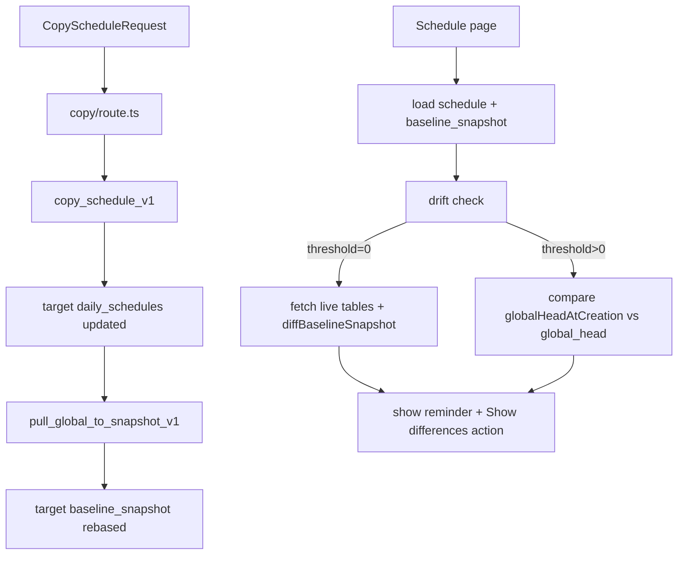

## Goals

- Make schedule copying **stop propagating legacy baseline snapshots** by rebasing the **target** `baseline_snapshot` to the **current published (Global) configuration** every time.
- Make drift notification semantics match user expectations:
  - **Off**: never show reminders.
  - **Always**: if the schedule’s saved snapshot differs from current published config, show a reminder (diff-based).
  - **Custom threshold**: keep the current lightweight version-based behavior (and only remind if snapshot is “old enough”).
- Improve wording/UI so non-technical users understand what’s happening.

## Current behavior (what we’ll change)

- Copy API currently builds the target baseline envelope from a (possibly inherited) snapshot payload and writes it via `copy_schedule_v1`.
  - See `[app/api/schedules/copy/route.ts](/Users/alvin/Desktop/RBIP web app/app/api/schedules/copy/route.ts)` around where `targetBaselineEnvelope` is built and passed into `copy_schedule_v1`.
- Schedule drift reminder currently:
  - Uses `get_config_global_head_v1` + version comparisons.
  - Does **not** run a real diff.
  - See `[app/(dashboard)/schedule/page.tsx](/Users/alvin/Desktop/RBIP web app/app/(dashboard)/schedule/page.tsx)` drift effect near `// Drift notification (post-load; admin/developer only)`.

## Proposed end-state (data flow)

## Implementation steps

### 1) Copy: always rebase target baseline to current Global

- **File**: `[app/api/schedules/copy/route.ts](/Users/alvin/Desktop/RBIP web app/app/api/schedules/copy/route.ts)`
- **Change**:
  - Keep using `copy_schedule_v1` for transactional allocation/override copying.
  - Immediately after a successful copy (both RPC fast-path and JS fallback), call `pull_global_to_snapshot_v1` to overwrite the target schedule’s `baseline_snapshot` with a fresh baseline built from current Global tables.
  - Pass **all categories** so the baseline is fully rebased.
  - Preserve existing `includeBufferStaff` semantics by forwarding it to the rebasing step.

### 2) DB: make rebasing respect includeBufferStaff

- **Migration**: add a new migration that updates the SQL function:
  - **File**: create something like `supabase/migrations/update_pull_global_to_snapshot_v1_include_buffer_staff.sql`.
  - **Update**: extend `public.pull_global_to_snapshot_v1` (from `[supabase/migrations/add_pull_global_to_snapshot_rpc.sql](/Users/alvin/Desktop/RBIP web app/supabase/migrations/add_pull_global_to_snapshot_rpc.sql)`) to accept an optional `p_include_buffer_staff boolean default true`.
  - **Behavior**:
    - When `p_include_buffer_staff = false`, downgrade staff rows where `status='buffer'` to `status='inactive'` in the snapshot baseline (and optionally clear `buffer_fte`).
    - Ensure existing Dashboard calls (which don’t pass the new arg) keep current behavior.

### 3) Schedule drift reminders: diff-based for “Always”

- **File**: `[app/(dashboard)/schedule/page.tsx](/Users/alvin/Desktop/RBIP web app/app/(dashboard)/schedule/page.tsx)`
- **Change**: in the existing drift effect:
  - Keep **Off** handling (`value>=3650 days`).
  - If `thresholdMs > 0`: keep the current version-based logic.
  - If `thresholdMs === 0` (Always):
    - After initial paint (idle callback / `setTimeout`), fetch the live global tables (same slices used by Sync/Publish) and run `diffBaselineSnapshot`.
    - If any diff bucket is non-empty, show a reminder.
  - Run once per `{date|scheduleId}` using the existing `lastDriftToastKeyRef`.
  - Cancel work if user navigates away.
- **Files used**:
  - Diff engine: `[lib/features/schedule/snapshotDiff.ts](/Users/alvin/Desktop/RBIP web app/lib/features/schedule/snapshotDiff.ts)`
  - Snapshot unwrap: `[lib/utils/snapshotEnvelope.ts](/Users/alvin/Desktop/RBIP web app/lib/utils/snapshotEnvelope.ts)`

### 4) Improve drift reminder UI/message

- **File**: `[app/(dashboard)/schedule/page.tsx](/Users/alvin/Desktop/RBIP web app/app/(dashboard)/schedule/page.tsx)`
- **Change**:
  - Replace the tech-heavy title/description with human wording (e.g., “This schedule is using saved settings that differ from the current published setup.”).
  - Use `ActionToast` `actions` to include a **“Show differences”** button that opens the existing snapshot diff UI.
- **Component capabilities**:
  - `[components/ui/action-toast.tsx](/Users/alvin/Desktop/RBIP web app/components/ui/action-toast.tsx)` supports an `actions` slot.

### 5) Dashboard Sync/Publish: revamp threshold UI

- **File**: `[components/dashboard/ConfigSyncPanel.tsx](/Users/alvin/Desktop/RBIP web app/components/dashboard/ConfigSyncPanel.tsx)`
- **Change**:
  - Replace the current layout (Off/Always on the right + numeric control) with a clearer, stateful UI:
    - A 3-state control: **Off / Always / Custom**.
    - Visually indicate active state based on current `drift_notification_threshold`:
      - Off: `value>=3650 days`
      - Always: `value==0 days`
      - Custom: otherwise
    - Show the numeric + unit picker only in Custom mode.
  - Update descriptive copy to non-technical language.

### 6) Verification

- Run `npm run build` to ensure strict TS passes.
- Manual test checklist:
  - Copy from an old legacy-rooted schedule → target date shows snapshot baseline rebased to current Global (Sync/Publish diff should shrink meaningfully).
  - With threshold **Always**, opening Schedule triggers reminder when real diffs exist; no reminder when diffs don’t.
  - With threshold **Off**, no reminder.
  - With threshold **Custom**, reminder only after age threshold and only when versions differ.

## Notes / expected behavior changes

- Copy will still copy allocations/overrides from the source date, but the **target baseline snapshot becomes a fresh per-date frozen copy of current Global**. This prevents “1/12/2025 baseline payload” from propagating indefinitely.
- Drift reminder becomes more intuitive in Always mode, even when `global_version` stays at v1 during testing.

