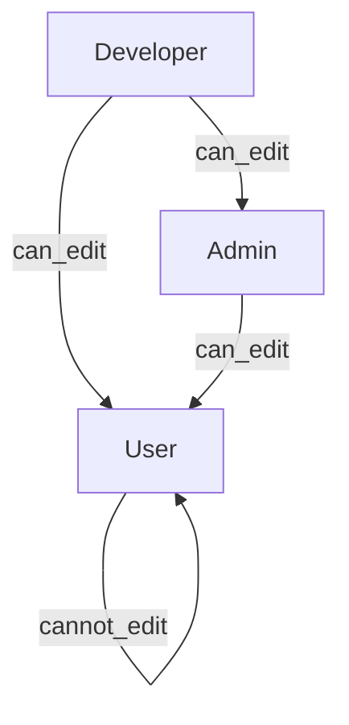

## UX / Visual draft

### Account Management panel

- Add a **2-tab layout** at the top of Account Management:
  - **Accounts** (existing table + actions)
  - **Access settings** (new)

### Access settings tab (reader-friendly)

- **Header row**
  - Title: “Access settings”
  - Subtitle: “Control what each role can see. Higher roles can configure lower roles.”
  - Right side actions:
    - `Restore defaults` (for the viewed role; only if editable)
    - `Save changes`
- **Role selector (segmented control / tabs)**
  - Tabs: `Developer` | `Admin` | `User`
  - **Editability rules** (enforced server-side):
    - Developer can edit Admin + User
    - Admin can edit User only
    - Users cannot edit any
    - Same-rank cannot edit peers
    - Developer tab shown as **read-only by default** (safe: can’t lock out developer)
- **Grouped toggle cards** (each card is a section)
  - Card: **Dashboard (categories)**
    - Toggles (iOS-style):
      - Special Programs
      - SPT Allocations
      - PCA Preferences
      - Staff Profile
      - Ward Config and Bed Stat
      - Team Configuration
      - Account Management
      - Sync / Publish
  - Card: **Navbar / Pages**
    - Toggles:
      - Show Dashboard link
      - Show History link
  - Card: **Schedule (diagnostics & developer tools)**
    - Toggles:
      - Show “Schedule Allocation” load diagnostics tooltip
      - Show Copy/Save diagnostics popovers/tooltips
      - Show “Reset to baseline” (StepIndicator)
      - Show snapshot health diagnostics
  - Card: **History (actions)**
    - Toggles:
      - Show Delete schedules UI
- Each toggle row shows:
  - Label + short description
  - `On/Off` switch
  - If user cannot change it: switch disabled + helper text (“Only Developer can change Admin settings” / “Read-only”).

### Mapping “all current role-gated things”

- We’ll create a central catalog so every role-gated check becomes `access.can(featureId)`.
- Initial catalog items will be derived from current codebase occurrences, including:
  - `components/schedule/ScheduleTitleWithLoadDiagnostics.tsx` (developer-only)
  - `app/(dashboard)/schedule/page.tsx` (developer-only copy/save tooltip + snapshot health bytes)
  - `components/allocation/StepIndicator.tsx` (developer-only reset-to-baseline)
  - `components/dashboard/AccountManagementPanel.tsx` (developer-only internal auth email, reset other passwords; admin restrictions on developer accounts)
  - `app/(dashboard)/history/page.tsx` (delete schedules UI)
  - Dashboard categories from `components/dashboard/DashboardSidebar.tsx` + `app/(dashboard)/dashboard/page.tsx`

## Data model (DB)

### New table

- Create single-row table `public.access_control_settings`:
  - `id boolean primary key default true`
  - `schema_version int not null default 1`
  - `settings jsonb not null` (shape: `{ roles: { user: Record<featureId, boolean>, admin: ..., developer: ... } }`)
  - `updated_at timestamptz not null default now()`
  - `updated_by uuid null`

### RLS

- `SELECT`: any authenticated user
- Block direct `UPDATE/INSERT/DELETE` for clients

### Update API (hierarchy enforced)

- Add API routes:
  - `app/api/access-settings/get/route.ts` (requires auth; returns settings)
  - `app/api/access-settings/update/route.ts` (requires auth; enforces hierarchy; writes via service-role admin client)
    - Developer can update `admin` and `user`
    - Admin can update only `user`
    - User cannot update

## Dashboard user access

- Change `[app/(dashboard)/dashboard/layout.tsx]` to `requireAuth()` (not `requireAdmin()`), so users can enter the dashboard.
- Then apply **UI-only** gating:
  - Filter sidebar categories by `access.can('dashboard.category.*')`
  - If a user navigates to a hidden panel, show a friendly “Not authorized to view this section” state.

## DB read access for user dashboard (minimum viable)

- Add migrations to allow `SELECT` for authenticated users on the dashboard tables needed for view-only panels:
  - `staff`, `staff_preferences`, `special_programs`, `spt_allocations`, `pca_preferences`, `wards`, `team_head_substitutions`, `team_settings`
- Keep write policies (`INSERT/UPDATE/DELETE`) as admin/developer only.
- Keep `user_profiles` as “own row only” (so account-management stays restricted).

## Implementation notes

- Add a small client hook `useAccessSettings()` that loads:
  - current user role
  - access settings JSON
  - exposes `can(featureId)` + `canEditRole(targetRole)`
- Refactor existing role checks to use the hook, so future gating is one-line and consistent.

## Mermaid: access hierarchy

