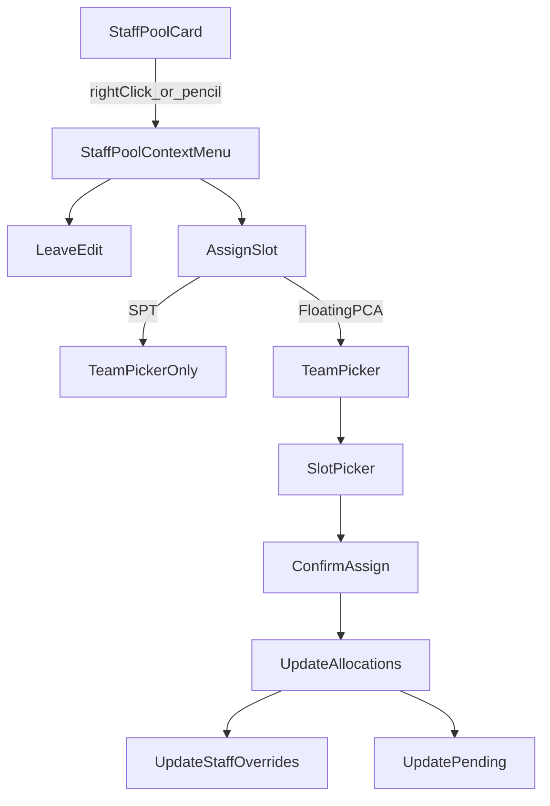

# Staff Pool Context Menu + Assign Slot

## Goals

- Add the existing `StaffContextMenu` UX to **Staff Pool** cards (therapist pool, PCA pool, buffer staff pool).
- Open menu via **right-click** or **hover pencil click**.
- Add a Staff Pool–only menu item **“Assign slot”** (icon: `CirclePlus`) inserted **after** “Leave edit” and **before** “Move slot”.
- Enforce existing **step gating** rules with disabled state + tooltip.
- Implement “Assign slot” behavior:
  - **Floating PCA (regular + buffer)**: 2-page non-modal popover (Team picker → Slot picker showing only remaining/unassigned slots) with confirm button.
    - If no remaining slots, disable menu item with tooltip.
    - Allow creating a **first allocation** when PCA currently has **0 slots assigned**.
    - After assignment, Staff Pool battery should reflect reduced `trueFTE` (it is derived from allocations, so it should update automatically once allocations are updated).
  - **Non-floating PCA**: hide “Assign slot”.
  - **Therapist**: only show for **SPT**; hide for APPT/RPT.
    - Assign **all remaining SPT FTE for the weekday** to a selected team.
    - If remaining SPT FTE is already fully assigned, disable menu item with tooltip (user should use Move/Split).
  - **Buffer staff (all ranks)**: show “Assign slot” where applicable:
    - Buffer therapists: Step 2 only.
    - Buffer floating PCA: Step 3 only.

## Key existing building blocks to reuse

- Context menu component: `[components/allocation/StaffContextMenu.tsx](components/allocation/StaffContextMenu.tsx)`
- Popovers: `[components/allocation/TeamPickerPopover.tsx](components/allocation/TeamPickerPopover.tsx)`, `[components/allocation/SlotSelectionPopover.tsx](components/allocation/SlotSelectionPopover.tsx)`
- Existing allocation mutation logic to mirror:
  - PCA slot transfer/discard: `performSlotTransfer()` / `performSlotDiscard()` in `[app/(dashboard)/schedule/page.tsx](app/\\\(dashboard)/schedule/page.tsx)`
  - SPT discard uses `removeTherapistAllocationFromTeam()`; we’ll add analogous “assign” mutation.

## Implementation approach

### 1) Add a Staff Pool context-menu state at the schedule page level

- In `[app/(dashboard)/schedule/page.tsx](app/\\\(dashboard)/schedule/page.tsx)` add a new state object (parallel to `staffContextMenu`) for **staff-pool cards**:
  - `{ show, position, staffId, kind }` where kind discriminates: `therapist` vs `pca` vs `buffer` (or infer from `staff` record).
- Add `openStaffPoolContextMenu(staffId, clickEvent)` that computes document-relative coordinates (reuse the `openStaffContextMenu` positioning logic).
- Render `<StaffContextMenu ...>` once at page root (outside scroll containers) so it cannot be clipped by Staff Pool overflow.

### 2) Wire Staff Pool cards to open the menu

- In `[components/allocation/StaffPool.tsx](components/allocation/StaffPool.tsx)`:
  - For each `StaffCard`, pass `onOpenContextMenu` for right-click.
  - Change the pencil handler (`onEdit`) to open the context menu instead of directly opening Leave Edit.
- In `[components/allocation/BufferStaffPool.tsx](components/allocation/BufferStaffPool.tsx)` apply the same (buffer cards currently have edit/convert actions).
- Ensure right-click does not trigger any drag-side effects:
  - `StaffCard` already `preventDefault/stopPropagation` on `onContextMenu`.
  - Additionally, when the staff-pool menu is open, set the corresponding `StaffCard`’s `draggable={false}` (only for the selected card) so no drag / snap-scroll can start while interacting.

### 3) Define Staff Pool menu items (with new “Assign slot”)

- Build items array in schedule page similar to the schedule-grid context menu, but:
  - Include: `Leave edit`, `**Assign slot**`, `Move slot`, `Discard slot`, plus therapist-only actions where applicable.
  - Apply visibility rules:
    - Hide Assign for non-floating PCA.
    - Hide Assign for APPT/RPT.
  - Apply step gating:
    - Leave edit enabled only in Step 1.
    - SPT Assign enabled only in Step 2.
    - Floating PCA Assign enabled only in Step 3.
    - Buffer staff use same rule based on rank.
  - Add disabled tooltips:
    - Step gating tooltip text updated to “Slot assignment is only available in Step X …”.
    - PCA: “All slots are already assigned.”
    - SPT: “All available SPT FTE is already assigned. Use Move slot / Split slot to amend.”

### 4) Implement PCA “Assign slot” action (2-page popover)

- Add a new state machine in schedule page similar to `pcaContextAction`, e.g. `pcaPoolAssignAction`:
  - `phase: 'team' | 'slots'`, `targetTeam`, `availableSlotsRemaining`, `selectedSlots`.
- Compute remaining slots:
  - Determine **capacity slots** from override/buffer capacity (same logic as StaffPool’s `getTrueFTERemaining` uses).
  - Subtract any already-assigned slots across `pcaAllocations` (includes special programs automatically).
- Popover flow:
  - Page 1: `TeamPickerPopover` (title “Assign slot”).
  - Page 2: `SlotSelectionPopover` in `mode='confirm'`, showing only remaining slots.
  - Confirm button triggers assignment.
- Assignment mutation:
  - If no existing allocation: create a new `PCAAllocation` object (similar to buffer-first-assignment logic in `performSlotTransfer`, but for regular PCA too).
  - If existing allocation: set selected empty slots to `targetTeam`, keep other slot assignments.
  - Rebuild `pcaAllocations` per-team lists using the “teamsWithSlots” pattern (same as `performSlotTransfer`).
  - Update `staffOverrides.slotOverrides` accordingly.
  - Update `pendingPCAFTEPerTeam[targetTeam] -= selectedSlots.length*0.25` (use slots-based delta).

### 5) Implement SPT “Assign slot” action (team picker only)

- Add a new state e.g. `sptPoolAssignAction` with `targetTeam` + `staffId` + `remainingFte`.
- Compute remaining SPT FTE for the weekday:
  - Base from `staffOverrides[staffId]?.fteRemaining` or `sptBaseFteByStaffId[staffId]` (already weekday-filtered).
  - Subtract current assigned SPT FTE summed across `therapistAllocations`.
- If remaining <= 0: disable menu item + tooltip.
- On confirm:
  - Add a new therapist allocation entry into `therapistAllocations[targetTeam]` with `fte_therapist = remaining`.
  - Update `staffOverrides.therapistTeamFTEByTeam` (or equivalent existing therapist override pathway) to reflect the new per-team split, so downstream save/recalc stays consistent.

### 6) Text tweaks for popovers

- Update `[components/allocation/SlotSelectionPopover.tsx](components/allocation/SlotSelectionPopover.tsx)` to support an “Assign slot” header variant (so it doesn’t say “move/discard”).

### 7) Verification (manual)

- Right click / pencil click on Staff Pool cards opens menu at a visible position (not clipped).
- Step gating:
  - Step 1: only Leave edit enabled.
  - Step 2: SPT assign enabled; PCA assign disabled.
  - Step 3: floating PCA assign enabled; SPT assign disabled.
- Floating PCA:
  - If 0 allocated slots → can Assign (creates allocation).
  - If all capacity slots allocated → Assign disabled with tooltip.
- SPT:
  - If remaining FTE > 0 → can Assign to a team.
  - If remaining FTE == 0 → Assign disabled with tooltip.

