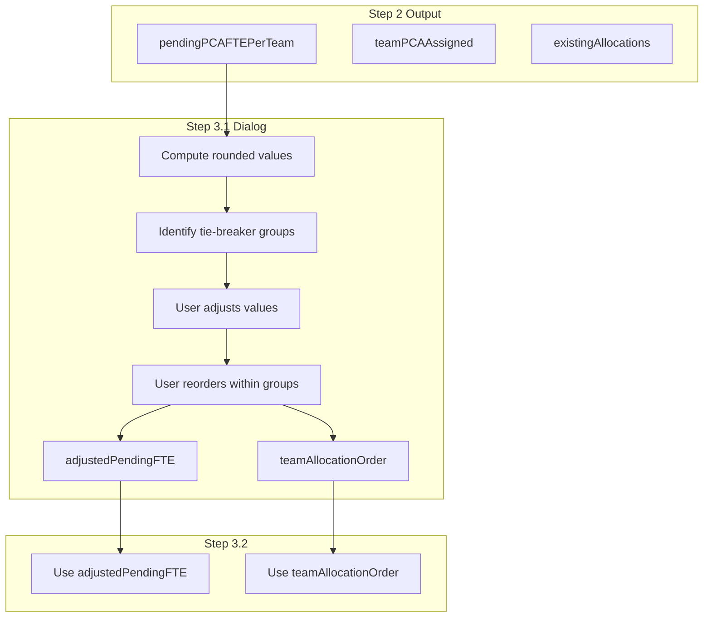

# Step 3.1: Floating PCA Configuration Dialog

## Context

Currently, the floating PCA allocation uses `pendingPCAFTEPerTeam` (rounded to 0.25) to determine team priority order. Tie-breakers are handled reactively via `TieBreakDialog.tsx` during allocation. The new Step 3.1 allows users to proactively adjust these values and team order BEFORE allocation runs.

## Data Flow



## UI Layout Design

### Dialog Structure

```javascript
+-----------------------------------------------------------------------------------+
|  Configure Floating PCA Allocation                                          [X]  |
+-----------------------------------------------------------------------------------+
|                                                                                   |
|  Adjust the pending PCA-FTE/team values and team priority order.                  |
|  Teams with the same value (highlighted) can be reordered by drag-and-drop.       |
|                                                                                   |
|  +--------+  +--------+  +--------+  +--------+  +--------+  +--------+  ...      |
|  |  FO    |  | CPPC   |  |  MC    |  |  SFM   |  |  DRO   |  |  NSM   |           |
|  |--------|  |--------|  |--------|  |--------|  |--------|  |--------|           |
|  | [0.75] |  | [0.75] |  | [0.75] |  | [0.50] |  | [0.50] |  | [0.25] |  ...      |
|  |  [-][+]|  |  [-][+]|  |  [-][+]|  |  [-][+]|  |  [-][+]|  |  [-][+]|           |
|  | :::::: |  | :::::: |  | :::::: |  |        |  |        |  | :::::: |           |
|  +--------+  +--------+  +--------+  +--------+  +--------+  +--------+           |
|   (orange)    (orange)    (orange)               (amber)       (teal)             |
|                                                                                   |
|  Legend: Colored borders indicate tie-breaker groups (can reorder within group)  |
|                                                                                   |
|                                              [Cancel]  [Save & Continue to 3.2]   |
+-----------------------------------------------------------------------------------+
```

### Card Component Details

Each team card contains:

1. **Team Name** - Header (e.g., "FO", "CPPC")
2. **Rounded Pending FTE Value** - Editable input field showing the rounded value (e.g., 0.75)
3. **Increment/Decrement Buttons** - [-] and [+] buttons to adjust by 0.25 intervals
4. **Drag Handle** - Visible only for teams in tie-breaker groups (6 dots icon `::::::`)
5. **Color Border** - Different colors per tie-breaker group

### Color Scheme for Tie-Breaker Groups

Using the existing Tailwind color palette to match the app's theme:

- **Group 1 (highest tied value)**: `border-orange-400` / `bg-orange-50`
- **Group 2**: `border-amber-400` / `bg-amber-50`
- **Group 3**: `border-teal-400` / `bg-teal-50`
- **Group 4**: `border-purple-400` / `bg-purple-50`
- **No tie (unique value)**: Default border (no highlight)

### Interaction Behaviors

1. **Value Adjustment**:

- Click [-] to decrease by 0.25 (min: 0)
- Click [+] to increase by 0.25 (no max, but practical limit ~2.0)
- On value change: re-sort teams by descending value, re-compute tie-breaker groups

2. **Drag-and-Drop**:

- Only teams within the same tie-breaker group can be reordered
- Drag handle appears only for tied teams
- Dragging outside the group snaps back to original position
- Visual feedback: ghost card while dragging, drop zone highlight

3. **Save Action**:

- Stores `adjustedPendingFTE: Record<Team, number>` (the adjusted rounded values)
- Stores `teamAllocationOrder: Team[]` (the final ordered list)
- Closes Step 3.1 dialog, auto-opens Step 3.2 dialog

## Key Files to Create/Modify

| File | Action | Description ||------|--------|-------------|| [`components/allocation/FloatingPCAConfigDialog.tsx`](components/allocation/FloatingPCAConfigDialog.tsx) | CREATE | New dialog component for Step 3.1 || [`components/allocation/TeamPendingCard.tsx`](components/allocation/TeamPendingCard.tsx) | CREATE | Reusable card component for each team || [`app/(dashboard)/schedule/page.tsx`](app/\\\\\\(dashboard)/schedule/page.tsx) | MODIFY | Add state for adjusted values, dialog trigger button, pass data to Step 3.2+ || [`lib/algorithms/pcaAllocation.ts`](lib/algorithms/pcaAllocation.ts) | MODIFY | Accept `teamAllocationOrder` to override default sorting || [`components/allocation/TieBreakDialog.tsx`](components/allocation/TieBreakDialog.tsx) | DEPRECATE | No longer needed after Step 3.1 handles tie-breakers upfront |

## State Structure

```typescript
// New state in schedule/page.tsx
const [floatingPCAConfigOpen, setFloatingPCAConfigOpen] = useState(false)
const [adjustedPendingFTE, setAdjustedPendingFTE] = useState<Record<Team, number> | null>(null)
const [teamAllocationOrder, setTeamAllocationOrder] = useState<Team[] | null>(null)

// Data passed to FloatingPCAConfigDialog
interface FloatingPCAConfigProps {
  open: boolean
  initialPendingFTE: Record<Team, number>  // From Step 2 result
  onSave: (adjustedFTE: Record<Team, number>, order: Team[]) => void
  onCancel: () => void
}


```