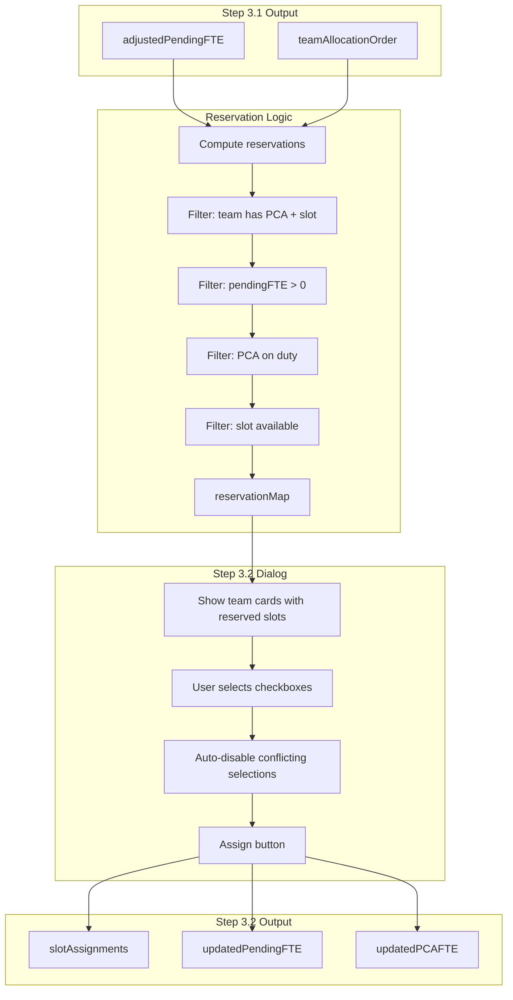

# Step 3.2: Preferred Slot Reservation System

## Context

When a team has BOTH preferred PCAs AND a preferred slot, we need to "reserve" that specific slot from those PCAs for that team. This prevents the slot from being allocated to higher-priority teams that don't have a preference for it. The reservation is not guaranteed - users must approve assignments via checkbox selection.

## Data Flow




## Reservation Data Structure

```typescript
// Team -> Slot -> PCA IDs that are reserved for this team
interface TeamReservations {
  [team: Team]: {
    slot: number  // The preferred slot (1-4)
    pcaIds: string[]  // Preferred PCA IDs that have this slot available
  } | null
}

// For conflict tracking: PCA -> Slot -> Teams that reserved this
interface PCASlotReservations {
  [pcaId: string]: {
    [slot: number]: Team[]
  }
}

// User selections: which reserved slots to actually assign
interface SlotAssignment {
  team: Team
  slot: number
  pcaId: string
}
```


## UI Design

### Wizard Structure

Convert `FloatingPCAConfigDialog` to a wizard with internal steps:

```javascript
+--------------------------------------------------------------------------------+
|  Configure Floating PCA Allocation                                       [X]  |
|--------------------------------------------------------------------------------|
|  [Step 3.1: Adjust Pending FTE] --> [Step 3.2: Reserved Slots] --> [3.3 ...]  |
|--------------------------------------------------------------------------------|
|                                                                                |
|  Step 3.2: Assign Reserved Slots                                               |
|  Approve which preferred PCA slots to assign to each team.                     |
|                                                                                |
|  FO --> CPPC --> MC --> GMC --> ...  (same order as 3.1)                       |
|  [card]  [card]  [card] [card]                                                 |


|          |              |                                                      |
|          | Slot 4:      | Slot 4:                                              |
|          | [x] 淑貞     | [ ] 淑貞 (disabled)                                   |
|          | [ ] 君       | [ ] 君                                               |
|                                                                                |
|  Note: Same slot of same PCA can only be assigned to one team.                 |
|                                                                                |
|                                    [Back to 3.1]  [Assign & Continue to 3.3]   |
+--------------------------------------------------------------------------------+


```


### Card Component for 3.2

Each team card shows:

1. Team name
2. Adjusted pending FTE (from 3.1)
3. Reserved slots section (if any):

- Slot number
- List of reserved PCAs with checkboxes
- Disabled checkboxes for PCAs already selected by another team

## Key Files to Modify/Create

| File | Action | Description ||------|--------|-------------|| [`components/allocation/FloatingPCAConfigDialog.tsx`](components/allocation/FloatingPCAConfigDialog.tsx) | MODIFY | Convert to wizard with currentMiniStep state (3.1, 3.2) || [`components/allocation/TeamReservationCard.tsx`](components/allocation/TeamReservationCard.tsx) | CREATE | New card for Step 3.2 showing reserved slots with checkboxes || [`lib/utils/reservationLogic.ts`](lib/utils/reservationLogic.ts) | CREATE | Pure functions for computing reservations || [`app/(dashboard)/schedule/page.tsx`](app/\\\\\(dashboard)/schedule/page.tsx) | MODIFY | Pass additional data (existingAllocations, staff) to dialog |

## Reservation Logic (Action 1)

```typescript
function computeReservations(
  pcaPreferences: PCAPreference[],
  adjustedPendingFTE: Record<Team, number>,
  floatingPCAs: PCAData[],
  existingAllocations: PCAAllocation[]
): { teamReservations: TeamReservations, pcaSlotReservations: PCASlotReservations } {
  
  for each team preference:
    // Skip if no preferred PCA OR no preferred slot
    if (!pref.preferred_pca_ids.length || !pref.preferred_slots.length) continue
    
    // Skip if team's adjusted pendingFTE = 0
    const pendingFTE = roundToQuarter(adjustedPendingFTE[team])
    if (pendingFTE <= 0) continue
    
    const preferredSlot = pref.preferred_slots[0]  // Only 1 slot allowed
    
    for each pcaId in pref.preferred_pca_ids:
      const pca = floatingPCAs.find(p => p.id === pcaId)
      
      // Skip if PCA not on duty
      if (!pca || pca.fte_pca <= 0) continue
      
      // Skip if slot already assigned in previous steps
      const existingAlloc = existingAllocations.find(a => a.staff_id === pcaId)
      if (existingAlloc && getSlotTeam(existingAlloc, preferredSlot)) continue
      
      // Reserve this slot
      addReservation(team, preferredSlot, pcaId)
}
```


## Assignment Logic (Action 2)

When user clicks "Assign & Continue":

```typescript
function executeSlotAssignments(
  assignments: SlotAssignment[],
  adjustedPendingFTE: Record<Team, number>,
  staffOverrides: StaffOverrides,
  existingAllocations: PCAAllocation[]
): {
  updatedPendingFTE: Record<Team, number>,
  updatedStaffOverrides: StaffOverrides,
  updatedAllocations: PCAAllocation[]
} {
  
  for each assignment:
    // Decrement team's pending FTE
    updatedPendingFTE[assignment.team] -= 0.25
    
    // Update PCA's slot assignment
    // (update existingAllocations to mark slot as assigned)
    
    // Update staffOverrides for the PCA
    // (track slot_assigned, fte_remaining)
}


```