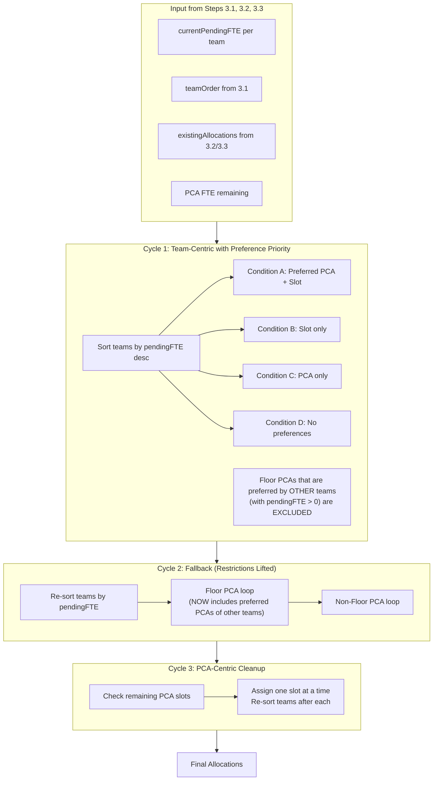

# Revised Floating PCA Algorithm - Step 3.4

## Architecture Overview

The new algorithm operates in 3 cycles, each with distinct rules for PCA exclusion and priority:



## Key Files to Modify

| File | Changes |

|------|---------|

| [`lib/algorithms/pcaAllocation.ts`](lib/algorithms/pcaAllocation.ts) | Add new `allocateFloatingPCA_v2()` function with 3-cycle logic |

| [`lib/utils/floatingPCAHelpers.ts`](lib/utils/floatingPCAHelpers.ts) | NEW: Extract reusable helper functions + allocation tracking |

| [`types/schedule.ts`](types/schedule.ts) | Add `SlotAssignmentLog` and `TeamAllocationLog` interfaces |

| [`components/allocation/FloatingPCAConfigDialog.tsx`](components/allocation/FloatingPCAConfigDialog.tsx) | Update to call new algorithm in Step 3.4 |

| [`components/allocation/PCABlock.tsx`](components/allocation/PCABlock.tsx) | Rewrite tooltip with allocation tracking display |---

## Implementation Tasks

### Task 1: Create Helper Functions Module

Create [`lib/utils/floatingPCAHelpers.ts`](lib/utils/floatingPCAHelpers.ts) with reusable functions:

```typescript
// 1. Floor PCA matching
function isFloorPCAForTeam(pca: PCAData, teamFloor: 'upper' | 'lower'): boolean

// 2. Find available PCAs with filtering
function findAvailablePCAs(options: {
  pcaPool: PCAData[]
  team: Team
  teamFloor: 'upper' | 'lower' | null
  floorMatch: 'same' | 'different' | 'any'
  excludePreferredOfOtherTeams: boolean
  preferredPCAIdsOfOtherTeams: Map<string, Team[]>  // Only teams with pendingFTE > 0
  requiredSlot?: number
  existingAllocations: PCAAllocation[]
}): PCAData[]

// 3. Slot assignment with AM/PM balancing
function assignSlotsToTeam(options: {
  pca: PCAData
  allocation: PCAAllocation
  team: Team
  pendingFTE: number
  teamExistingSlots: number[]  // Already assigned slots for overlap check
  gymSlot: number | null
  avoidGym: boolean
}): { slotsAssigned: number[]; newPendingFTE: number }

// 4. Check if slot is available for team
function isSlotAvailableForTeam(
  allocation: PCAAllocation,
  slot: number,
  team: Team,
  gymSlot: number | null,
  avoidGym: boolean
): boolean
```

### Task 2: Implement Cycle 1 Logic

Add to [`lib/algorithms/pcaAllocation.ts`](lib/algorithms/pcaAllocation.ts):**Condition A: Preferred PCA + Preferred Slot** (Steps 4-43)

1. Try preferred PCA(s) for preferred slot
2. Fallback to floor PCA for preferred slot
3. Fallback to non-floor PCA for preferred slot
4. Then fill remaining slots from preferred PCA(s)
5. Then fill remaining from floor PCA (excluding preferred of other teams)

**Condition B: Preferred Slot Only** (Steps 44-65)

1. Find floor PCA with preferred slot available
2. Assign preferred slot, then fill remaining from same PCA
3. Fallback to non-floor PCA if needed

**Condition C: Preferred PCA Only** (Steps 25-43)

- Same as Condition A, but skip preferred slot logic

**Condition D: No Preferences** (Steps 66-75)

1. Find floor PCA (excluding preferred of other teams)
2. Assign all available slots from same PCA

### Task 3: Implement Cycle 2 Logic

**Floor PCA Fallback** (Steps 76-84)

- Re-sort teams by pendingFTE
- REMOVE the "exclude preferred of other teams" restriction
- Assign floor PCA slots to teams with pendingFTE > 0

**Non-Floor PCA Fallback** (Steps 85-96)

- Same pattern but with non-floor PCAs

### Task 4: Implement Cycle 3 Logic

**PCA-Centric Cleanup** (Steps 97-106)

- Find PCAs with unassigned slots
- For each PCA slot, assign to team with highest pendingFTE
- Re-sort teams after each assignment
- Continue until all PCA slots assigned OR all teams satisfied

### Task 5: AM/PM Balancing Logic

Implement in `assignSlotsToTeam()`:

```typescript
// When pendingFTE = 0.5 and PCA has >=0.75 FTE remaining:
// Try to assign one slot from AM (1 or 2) and one from PM (3 or 4)

// When pendingFTE = 0.25:
// Prefer slots where team has no PCA assigned yet

// When pendingFTE = 0.75:
// Assign 3 slots, prefer 2 AM + 1 PM or 1 AM + 2 PM

// When pendingFTE = 1.0:
// Assign 4 slots (all), ideally 2 AM + 2 PM
```

### Task 6: Gym Slot Integration

In `isSlotAvailableForTeam()`:

```typescript
function isSlotAvailableForTeam(
  allocation: PCAAllocation,
  slot: number,
  team: Team,
  gymSlot: number | null,
  avoidGym: boolean
): boolean {
  // 1. Check if slot is already assigned in allocation
  const slotTeam = getSlotTeam(allocation, slot)
  if (slotTeam !== null) return false  // Already assigned
  
  // 2. Check gym slot avoidance
  if (avoidGym && gymSlot === slot) return false
  
  return true
}
```

### Task 7: Context Tracking for Return Logic

For step (65) return context:

```typescript
type PCAlloopContext = 'floor' | 'nonFloor' | 'preferred'

function processNonPreferredSlots(
  team: Team,
  pca: PCAData,
  callerContext: PCAlloopContext,
  // ... other params
): void {
  // Process slots from this PCA
  // When PCA exhausted, return to caller context loop
}
```

### Task 8: Integration with Step 3.4 Dialog

Update [`components/allocation/FloatingPCAConfigDialog.tsx`](components/allocation/FloatingPCAConfigDialog.tsx):

```typescript
// In handleFinalSave or new handleStep34Execute:
const result = await allocateFloatingPCA_v2({
  teamOrder: teamOrder,          // From Step 3.1
  currentPendingFTE: currentPendingFTE,  // From Step 3.3
  existingAllocations: updatedAllocations,  // From Step 3.2/3.3
  pcaPool: floatingPCAs,
  pcaPreferences: pcaPreferences,
  specialPrograms: specialPrograms,
})
```

---

## Data Flow Summary

```javascript
Step 3.1 Output:
                - adjustedFTE (user-adjusted pending FTE)
                - teamOrder (user-defined priority)
       |
       v
Step 3.2 Output:
                - currentPendingFTE (updated after preferred slot assignments)
                - updatedAllocations (with preferred slot assignments)
                - pcaFTEChanges (PCA FTE remaining)
       |
       v
Step 3.3 Output:
                - currentPendingFTE (updated after adjacent slot assignments)
                - updatedAllocations (with adjacent slot assignments)
                - pcaFTEChanges (PCA FTE remaining)
       |
       v
Step 3.4 Input:
                - currentPendingFTE from Step 3.3
                - teamOrder from Step 3.1
                - updatedAllocations from Step 3.3
                - floatingPCAs with updated FTE remaining
       |
       v
Step 3.4 Output:
                - Final allocations
                - Final pendingFTE (may still be > 0 for some teams)
                - Errors (if any preferred slots could not be assigned)
```

---

## Allocation Tracking System

### Purpose

Track every assignment decision for transparency and debugging. This information will be displayed in a tooltip when hovering over the "Assigned: xxx" text in the PCA Block.

### Tracking Data Structure

Add to [`types/schedule.ts`](types/schedule.ts):

```typescript
/**
    * Tracks how a specific slot was assigned to a team.
    * Used for tooltip display and debugging.
 */
export interface SlotAssignmentLog {
  slot: number                    // 1, 2, 3, or 4
  pcaId: string                   // Which PCA was assigned
  pcaName: string                 // PCA name for display
  assignedIn: 'step32' | 'step33' | 'step34'  // Which step made this assignment
  
  // Step 3.4 specific tracking
  cycle?: 1 | 2 | 3              // Which cycle (only for step34)
  condition?: 'A' | 'B' | 'C' | 'D'  // Which condition (only for step34 cycle 1)
  
  // Decision factors
  wasPreferredSlot?: boolean      // Was this the team's preferred slot?
  wasPreferredPCA?: boolean       // Was this the team's preferred PCA?
  wasFloorPCA?: boolean           // Was this a floor-matched PCA?
  wasExcludedInCycle1?: boolean   // Did this PCA become available only in Cycle 2?
  
  // Constraint handling
  amPmBalanceAchieved?: boolean   // Was AM/PM balance achieved?
  gymSlotAvoided?: boolean        // Was gym slot avoided (if applicable)?
  overlapSlot?: boolean           // Was this slot already assigned to another PCA?
}

/**
    * Aggregated tracking info per team for tooltip display.
 */
export interface TeamAllocationLog {
  team: Team
  assignments: SlotAssignmentLog[]
  summary: {
    totalSlotsAssigned: number
    fromStep32: number
    fromStep33: number
    fromStep34Cycle1: number
    fromStep34Cycle2: number
    fromStep34Cycle3: number
    preferredSlotFilled: boolean
    preferredPCAsUsed: number
    floorPCAsUsed: number
    nonFloorPCAsUsed: number
    amPmBalanced: boolean
    gymSlotUsed: boolean  // true if gym slot was assigned despite avoidance
  }
}
```

### Recording Assignments

Update [`lib/utils/floatingPCAHelpers.ts`](lib/utils/floatingPCAHelpers.ts):

```typescript
// Global or context-level tracking object
export type AllocationTracker = Record<Team, TeamAllocationLog>

// Function to record an assignment
export function recordAssignment(
  tracker: AllocationTracker,
  team: Team,
  log: SlotAssignmentLog
): void {
  if (!tracker[team]) {
    tracker[team] = {
      team,
      assignments: [],
      summary: { /* ... initialize */ }
    }
  }
  tracker[team].assignments.push(log)
  // Update summary counts
}
```

### Sample Tracking During Assignment

```typescript
// In assignSlotsToTeam():
for (const slot of slotsToAssign) {
  // ... assign slot ...
  
  recordAssignment(tracker, team, {
    slot,
    pcaId: pca.id,
    pcaName: pca.name,
    assignedIn: 'step34',
    cycle: currentCycle,
    condition: currentCondition,
    wasPreferredSlot: slot === preferredSlot,
    wasPreferredPCA: preferredPCAIds.includes(pca.id),
    wasFloorPCA: isFloorPCA,
    wasExcludedInCycle1: currentCycle === 2 && wasExcludedBefore,
    amPmBalanceAchieved: hasAMSlot && hasPMSlot,
    gymSlotAvoided: gymSlot !== null && slot !== gymSlot,
    overlapSlot: teamExistingSlots.includes(slot),
  })
}
```

### Tooltip Display in PCABlock

Update [`components/allocation/PCABlock.tsx`](components/allocation/PCABlock.tsx):Replace the current tooltip content with allocation tracking display:

```tsx
{/* Allocation Tracking Tooltip */}
<div className="absolute left-0 bottom-full mb-2 w-80 p-3 bg-gray-900 text-white text-xs rounded shadow-lg opacity-0 invisible group-hover:opacity-100 group-hover:visible transition-opacity z-50 pointer-events-none">
  <div className="space-y-2">
    {/* Summary Header */}
    <div className="font-semibold border-b border-gray-700 pb-1">
      Allocation Tracking - {team}
    </div>
    
    {/* Summary Stats */}
    <div className="grid grid-cols-2 gap-1 text-[10px]">
      <div>Total slots: {summary.totalSlotsAssigned}</div>
      <div>From 3.2: {summary.fromStep32}</div>
      <div>From 3.3: {summary.fromStep33}</div>
      <div>From 3.4: {summary.fromStep34Cycle1 + summary.fromStep34Cycle2 + summary.fromStep34Cycle3}</div>
    </div>
    
    {/* Per-Slot Details */}
    <div className="space-y-1 border-t border-gray-700 pt-1">
      {assignments.map((a, i) => (
        <div key={i} className="text-[10px]">
          <span className="font-mono">Slot {a.slot}:</span>
          <span className="ml-1">{a.pcaName}</span>
          <span className="ml-1 text-gray-400">
            ({a.assignedIn === 'step34' 
              ? `C${a.cycle}${a.condition ? `-${a.condition}` : ''}` 
              : a.assignedIn})
          </span>
          {a.wasPreferredPCA && <span className="ml-1 text-green-400">★PCA</span>}
          {a.wasPreferredSlot && <span className="ml-1 text-blue-400">★Slot</span>}
          {a.wasFloorPCA && <span className="ml-1 text-yellow-400">Floor</span>}
          {a.wasExcludedInCycle1 && <span className="ml-1 text-orange-400">C2-unlocked</span>}
        </div>
      ))}
    </div>
    
    {/* Constraint Status */}
    <div className="text-[10px] border-t border-gray-700 pt-1 text-gray-400">
      AM/PM: {summary.amPmBalanced ? '✓ Balanced' : '○ Not balanced'}
      {' | '}
      Gym: {summary.gymSlotUsed ? '⚠ Used' : '✓ Avoided'}
    </div>
  </div>
</div>
```

### Legend for Tooltip Badges

| Badge | Meaning |

|-------|---------|

| `★PCA` | This was the team's preferred PCA |

| `★Slot` | This was the team's preferred slot |

| `Floor` | This was a floor-matched PCA |

| `C2-unlocked` | This PCA was excluded in Cycle 1 (preferred by another team) but became available in Cycle 2 |

| `C1-A/B/C/D` | Assigned in Cycle 1 under condition A, B, C, or D |

| `C2` | Assigned in Cycle 2 (fallback) |

| `C3` | Assigned in Cycle 3 (final cleanup) |

### Data Flow for Tracking

The allocation tracker needs to flow from the algorithm to the UI:

```javascript
allocateFloatingPCA_v2()
    ↓ returns AllocationTracker
FloatingPCAConfigDialog (handleFinalSave)
    ↓ passes to onSave callback
schedule/page.tsx
    ↓ stores in state: allocationTracker
    ↓ passes to TeamColumn
TeamColumn
    ↓ passes to PCABlock
PCABlock
    ↓ displays in tooltip
```

**Algorithm return type update:**

```typescript
export interface FloatingPCAAllocationResult {
  allocations: PCAAllocation[]
  pendingPCAFTEPerTeam: Record<Team, number>
  tracker: AllocationTracker  // NEW: Add tracking data
  errors?: {
    preferredSlotUnassigned?: string[]
  }
}
```

**Props addition to PCABlock:**

```typescript
interface PCABlockProps {
  // ... existing props ...
  allocationTracker?: TeamAllocationLog  // NEW: Tracking data for this team
}
```

---

## Error Handling

| Condition | Action |

|-----------|--------|

| Preferred slot cannot be assigned by any PCA | Show error in Step Indicator, continue with remaining slots |

| Team pendingFTE > 0 after all cycles | Allowed - show warning, not error |

| PCA has unassigned slots after Cycle 3 | Should not happen - Cycle 3 assigns all remaining slots |---

## Testing Considerations

1. **Test Case: Preferred PCA + Slot already assigned in 3.2**

- Algorithm should skip to step (25) and assign remaining slots

2. **Test Case: Floor PCA is preferred by another team**

- Cycle 1: Should exclude this PCA
- Cycle 2: Should include this PCA

3. **Test Case: AM/PM balancing with limited PCA slots**

- If PCA only has AM slots, assign what's available

4. **Test Case: Gym slot avoidance**