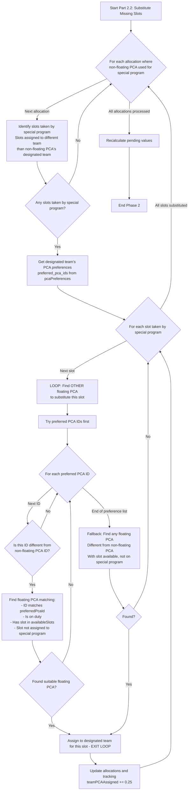
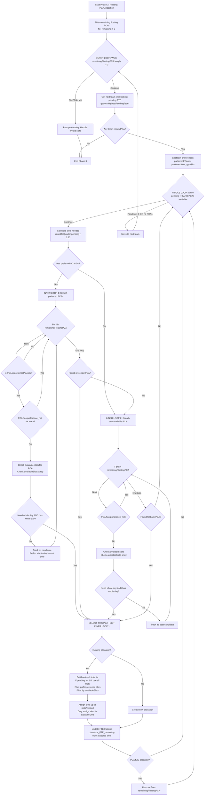

# PCA Allocation Algorithm Flow Diagram

## Overview
The PCA allocation algorithm operates in three main phases:
1. **Phase 1: Non-Floating PCA Allocation** - Assigns non-floating PCAs to their designated teams
2. **Phase 2: Special Program Allocation** - Allocates PCAs for special programs (Robotic, CRP, DRM, etc.)
3. **Phase 3: Floating PCA Allocation** - Distributes floating PCAs based on team needs and preferences

---

## Important Terminology: FTE Values

### Two Types of FTE Values

1. **`fte_pca` (Base FTE from Leave Settings)**
   - **Source**: User enters "FTE-remaining" in the edit dialog (e.g., 0.7)
   - **Purpose**: Used to calculate `averagePCAPerTeam` (team requirements) **BEFORE allocation**
   - **Calculation**: Sum of all `fte_pca` values from all available PCAs
   - **Example**: If 3 PCAs have `fte_pca = [1.0, 0.7, 0.8]`, then `totalPCA = 2.5` (sum, not count)
   - **Note**: This is the "base" FTE that reflects leave settings, but may not match actual available slots

2. **`true_FTE_remaining` (True FTE from Available Slots)**
   - **Source**: Calculated from user-selected available slots
   - **Purpose**: Used for **actual allocation decisions** during allocation
   - **Calculation**: `availableSlots.length × 0.25`
   - **Example**: If `fte_pca = 0.7` but user selects slots 1, 2, 3 as available → `true_FTE_remaining = 0.75` (3 slots × 0.25)
   - **Note**: This is the actual FTE that can be allocated, based on which slots are available

### Key Distinction
- **Before Allocation**: Use `fte_pca` (sum) to calculate `averagePCAPerTeam` (team requirements)
- **During Allocation**: Use `true_FTE_remaining` (from available slots) for allocation decisions

---

## Calculation of `averagePCAPerTeam` (Team Requirements)

### Formula

```
averagePCAPerTeam[team] = (total no. of bed/team) / (total no. of bed/PCA)
```

### Expanded Formula

Where:
- **a**: `(total no. of bed/a GIVEN TEAM) = (no. Of bed per A GIVEN THERAPIST) × (sum of therapist-base FTE of THAT TEAM)`
- **b**: `(no. Of bed/ A GIVEN THERAPIST) = (total beds across ALL TEAMS) / (sum of therapist-base FTE of ALL TEAMS)`
- **c**: `(total no. of bed/PCA) = (total beds across all teams) / (sum of fte_pca)`
- **e**: `(average PCA/ a given team) = a / c`

### Simplified Formula

Substituting the expanded terms:
```
averagePCAPerTeam[team] = [(total beds / sum of all therapist FTE) × (sum of therapist FTE for that team)] / [(total beds) / (sum of fte_pca)]
```

Simplifying:
```
averagePCAPerTeam[team] = (sum of therapist FTE for that team) × (sum of fte_pca) / (sum of all therapist FTE)
```

### Usage Notes

- **e** (`averagePCAPerTeam[team]`) is displayed in Block 6 and used for PCA allocation (rounded to nearest 0.25)
- **a** (`total no. of bed/a GIVEN TEAM`) is used to compute relieving beds in Block 5

### Code Implementation

```typescript
// Step 1: Calculate sum of therapist-base FTE per team (from leave settings)
const ptPerTeamFromResult: Record<Team, number> = { ... }
let totalPTOnDuty = 0

therapistResult.allocations.forEach(alloc => {
  const override = overrides[alloc.staff_id]
  const fte = override ? override.fteRemaining : (alloc.fte_therapist || 0)
  // fte = therapist-base FTE from leave settings (e.g., 0.7, 0.6, 0.2)
  if (isTherapist && fte > 0) {
    ptPerTeamFromResult[alloc.team] += fte  // Sum for that team
    totalPTOnDuty += fte                     // Sum across all teams
  }
})

// Step 2: Calculate sum of PCA-base FTE (from leave settings)
const totalPCA = pcaData
  .filter(p => p.is_available)
  .reduce((sum, p) => sum + p.fte_pca, 0)  // Sum of fte_pca values

// Step 3: Calculate averagePCA per team
const averagePCAPerTeam: Record<Team, number> = {}
TEAMS.forEach(team => {
  if (totalPTOnDuty > 0) {
    averagePCAPerTeam[team] = (ptPerTeamFromResult[team] * totalPCA) / totalPTOnDuty
    // = (sum of therapist FTE for that team) × (sum of fte_pca) / (sum of all therapist FTE)
  }
})
```

### Example Calculation

**Given:**
- **Therapists (Base FTE from leave settings)**:
  - Team FO: Therapist A = 0.7, Therapist B = 0.6, Therapist C = 0.2 → **Sum = 1.5**
  - Team SMM: Therapist D = 1.0, Therapist E = 0.8 → **Sum = 1.8**
  - **Total across all teams = 1.5 + 1.8 + ... = 10.0**

- **PCAs (Base FTE from leave settings)**:
  - PCA 1 = 1.0, PCA 2 = 0.7, PCA 3 = 0.8 → **Sum = 2.5**

- **Total beds across all teams = 100**

**Calculate for Team FO:**
```
averagePCAPerTeam[FO] = (1.5 × 2.5) / 10.0 = 3.75 / 10.0 = 0.375
```

**Interpretation:**
- Team FO has 1.5 therapist FTE (from leave settings)
- Total therapist FTE across all teams = 10.0
- Total PCA FTE available = 2.5
- Team FO gets proportionally: (1.5 / 10.0) × 2.5 = 0.375 PCA FTE

### Key Points
1. **Uses base FTE from leave settings** (not true FTE from available slots)
2. **Proportional distribution**: Teams with more therapist FTE get more PCA FTE
3. **Formula is independent of beds**: The beds cancel out in the final formula
4. **Must use sum of `fte_pca`** (not count of PCAs) for `totalPCA`

---

## Phase 1: Non-Floating PCA Allocation

### Part 1.1: Initial Assignment to Designated Teams

**Purpose**: Assign ALL available FTE of non-floating PCAs to their designated teams (no limit - can exceed required FTE).

**Key Values Used**:
- `baseFTE = pca.fte_pca` (base FTE from leave settings, e.g., 0.7)
- `trueFTE = availableSlots.length × 0.25` (true FTE from available slots, e.g., 0.75)
- **Allocation uses**: `trueFTE` (not `baseFTE`)

```mermaid
flowchart TD
    A[Start Phase 1: Non-Floating PCA Allocation] --> B[Filter: pca.floating = false AND pca.is_available = true]
    B --> C{For each non-floating PCA}
    C -->|Next PCA| D{Does PCA have a team?}
    D -->|No| C
    D -->|Yes| E[Get baseFTE = pca.fte_pca<br/>Base FTE from leave settings]
    E --> F[Get availableSlots from user selection<br/>e.g., [1,2,3] if slot 4 not available]
    F --> G[Calculate trueFTE = availableSlots.length × 0.25<br/>e.g., 3 slots = 0.75 FTE]
    G --> H[Assign ALL available slots to PCA's designated team<br/>NO LIMIT - can exceed required FTE<br/>Uses trueFTE for allocation]
    H --> I[Handle invalid slot if exists<br/>leave/comeback time]
    I --> J[Create allocation record]
    J --> K[Update teamPCAAssigned<br/>Add ALL trueFTE to designated team]
    K --> C
    C -->|All non-floating PCAs processed| L[Move to Part 1.2]
```

**Key Points**:
- **Uses `trueFTE`** (from available slots) for allocation, not `baseFTE` (from leave settings)
- **No FTE limit**: Assigns ALL `trueFTE` to designated team, even if it exceeds `averagePCAPerTeam[team]`
- **Example**: If team needs 0.5 FTE but non-floating PCA has `trueFTE = 0.75`, assign all 0.75 FTE
- **Loop exit**: When all non-floating PCAs are processed

---

### Part 1.2: Substitute Missing Slots with Floating PCAs

**Purpose**: For non-floating PCAs with unavailable slots, find floating PCAs to substitute those missing slots.

**Key Values Used**:
- Missing slots = slots NOT in `availableSlots` (e.g., if `availableSlots = [1,2,3]`, then slot 4 is missing)
- Floating PCA must have the missing slot in their `availableSlots` AND slot not assigned to special program

```mermaid
flowchart TD
    A[Start Part 1.2: Substitute Missing Slots] --> B{For each non-floating PCA allocation}
    B -->|Next allocation| C[Identify missing slots<br/>Slots NOT in availableSlots<br/>e.g., if availableSlots=[1,2,3], missing=[4]]
    C --> D{Any missing slots?}
    D -->|No| B
    D -->|Yes| E[Get designated team's PCA preferences<br/>preferred_pca_ids from pcaPreferences]
    E --> F{For each missing slot}
    F -->|Next slot| G[LOOP: Try preferred PCA IDs in order]
    G --> H{For each preferred PCA ID}
    H -->|Next ID| I[Find floating PCA matching:<br/>- ID matches preferredPcaId<br/>- pca.is_available = true<br/>- Has this slot in availableSlots<br/>- Slot not assigned to special program]
    I --> J{Found suitable floating PCA?}
    J -->|Yes| K[Assign floating PCA to non-floating PCA's team<br/>for this specific slot]
    J -->|No| H
    H -->|End of preference list| L[Fallback: Find any floating PCA<br/>with slot available, not on special program]
    L --> M{Found?}
    M -->|Yes| K
    M -->|No| F
    K --> N[Update allocation and tracking<br/>teamPCAAssigned += 0.25]
    N --> F
    F -->|All missing slots processed| B
    B -->|All non-floating PCAs done| O[End Phase 1]
```

**Key Loop Logic**:
```typescript
// OUTER LOOP: For each non-floating PCA
nonFloatingPCA.forEach((pca) => {
  // Identify missing slots (slots NOT in availableSlots)
  const allSlots = [1, 2, 3, 4]
  const availableSlots = pca.availableSlots || [1, 2, 3, 4]
  const missingSlots = allSlots.filter(slot => !availableSlots.includes(slot))
  
  // MIDDLE LOOP: For each missing slot
  missingSlots.forEach((missingSlot) => {
    // INNER LOOP 1: Try preferred PCA IDs
    for (const preferredPcaId of preferredPCAIds) {
      const floatingPca = floatingPCA.find(
        pca => pca.id === preferredPcaId &&
        pca.is_available &&
        // Check if this slot is available for the floating PCA
        (!pca.availableSlots || pca.availableSlots.length === 0 || pca.availableSlots.includes(missingSlot))
      )
      if (floatingPca && slotNotOnSpecialProgram) {
        // Assign and break - EXIT INNER LOOP 1
        break
      }
    }
    
    // INNER LOOP 2: Fallback to any available
    if (!substituteFound) {
      const fallback = floatingPCA.find(...)
      if (fallback) {
        // Assign - EXIT INNER LOOP 2
      }
    }
  }) // Exit MIDDLE LOOP when all slots processed
}) // Exit OUTER LOOP when all PCAs processed
```

**Loop Exit Conditions**:
- **Outer loop**: All non-floating PCAs processed
- **Middle loop**: All missing slots for current PCA processed
- **Preference loop exit**: Found matching PCA → `break` OR end of preference list
- **Fallback exit**: Found any matching PCA OR no PCAs available

---

## Phase 2: Special Program Allocation

### Part 2.1: Allocate PCAs to Special Programs

**Purpose**: Assign PCAs to special programs based on weekday requirements and preferences.

**Key Values Used**:
- Uses `true_FTE_remaining` (from available slots) for allocation decisions
- Checks if floating PCA has required slots in their `availableSlots`

```mermaid
flowchart TD
    A[Start Phase 2: Special Program Allocation] --> B{For each special program}
    B -->|Next program| C{Is program active today?<br/>weekday in program.weekdays}
    C -->|No| B
    C -->|Yes| D[Determine program slots<br/>Robotic: [1,2,3,4], CRP: [2], etc.]
    D --> E[Find teams needing this program<br/>teamPCAAssigned < required<br/>Check gym schedule conflicts]
    E --> F{Any teams need program?}
    F -->|No| B
    F -->|Yes| G{Has pca_preference_order?}
    G -->|Yes| H[LOOP: Try preference order]
    G -->|No| I[LOOP: Try any available PCA]
    
    H --> J{For each preferred PCA ID}
    J -->|Next ID| K[Search floating PCA pool first<br/>Match: ID, special_program, available<br/>Check: required slots in availableSlots]
    K --> L{Found floating PCA?}
    L -->|Yes| M[Assign PCA to program - EXIT LOOP]
    L -->|No| N[Search non-floating PCA pool<br/>Same criteria<br/>Check: required slots in availableSlots]
    N --> O{Found non-floating PCA?}
    O -->|Yes| M
    O -->|No| J
    J -->|Not found in preference list| P[Fallback: Find any PCA with special_program<br/>Check: required slots in availableSlots]
    
    I --> Q[Search floating PCA pool<br/>Has special_program, available<br/>Check: required slots in availableSlots]
    Q --> R{Found?}
    R -->|Yes| M
    R -->|No| S[Try non-floating pool]
    S --> T{Found?}
    T -->|Yes| M
    T -->|No| B
    
    P --> Q
    
    M --> U{Existing allocation?}
    U -->|Yes| V[Assign program slots to allocation<br/>Update special_program_ids]
    U -->|No| W[Create new allocation<br/>with program slots]
    V --> X[Update teamPCAAssigned<br/>For each slot team += 0.25]
    W --> X
    X --> Y[Mark program as assigned]
    Y --> B
    B -->|All programs done| Z[Move to Part 2.2]
```

**Key Loop Logic**:
```typescript
// OUTER LOOP: For each special program
context.specialPrograms.forEach((program) => {
  const programSlots = program.slots[weekday] || []
  
  // MIDDLE LOOP: Try preference order
  if (program.pca_preference_order) {
    for (const preferredPcaId of program.pca_preference_order) {
      // Try floating PCA first
      const floatingPca = floatingPCA.find(
        pca => pca.id === preferredPcaId &&
        pca.special_program?.includes(program.name) &&
        pca.is_available &&
        // Check if required slots are in availableSlots
        programSlots.every(slot => !pca.availableSlots || pca.availableSlots.includes(slot))
      )
      if (floatingPca) {
        // Assign and break - EXIT MIDDLE LOOP
        break
      }
      
      // Try non-floating PCA
      const nonFloatingPca = nonFloatingPCA.find(...)
      if (nonFloatingPca) {
        // Assign and break - EXIT MIDDLE LOOP
        break
      }
    }
    
    // If not found, fallback to any available
    if (!pcaToAssign) {
      // Fallback logic - EXIT when found or no PCAs available
    }
  }
}) // Exit OUTER LOOP when all programs processed
```

**Loop Exit Conditions**:
- **Outer loop**: All special programs processed
- **Preference loop exit**: Found matching PCA → `break` OR end of preference list
- **Fallback**: Found any matching PCA OR no PCAs available

---

### Part 2.2: Substitute Missing Slots (Edge Case)

**Purpose**: When a non-floating PCA was used for a special program, find OTHER floating PCAs to substitute the missing slots at the designated team.

**Key Values Used**:
- Identifies slots taken by special program (slots assigned to different team than non-floating PCA's designated team)
- Finds OTHER floating PCAs (different from the non-floating PCA) with those slots available



**Key Loop Logic**:
```typescript
// OUTER LOOP: For each allocation with non-floating PCA in special program
allocations.forEach((allocation) => {
  const nonFloatingPca = nonFloatingPCA.find(pca => pca.id === allocation.staff_id)
  if (!nonFloatingPca || !allocation.special_program_ids) return
  
  // Identify slots taken by special program
  const slotsTakenBySpecialProgram = [1,2,3,4].filter(slot => 
    allocation[`slot${slot}`] !== null && 
    allocation[`slot${slot}`] !== nonFloatingPca.team
  )
  
  // MIDDLE LOOP: For each slot taken
  slotsTakenBySpecialProgram.forEach((missingSlot) => {
    // INNER LOOP 1: Try preferred PCA IDs
    for (const preferredPcaId of preferredPCAIds) {
      if (preferredPcaId === nonFloatingPca.id) continue // Must be DIFFERENT
      
      const floatingPca = floatingPCA.find(
        pca => pca.id === preferredPcaId &&
        pca.is_available &&
        (!pca.availableSlots || pca.availableSlots.length === 0 || pca.availableSlots.includes(missingSlot))
      )
      if (floatingPca && slotNotOnSpecialProgram) {
        // Assign and break - EXIT INNER LOOP 1
        break
      }
    }
    
    // INNER LOOP 2: Fallback
    if (!substituteFound) {
      const fallback = floatingPCA.find(pca => 
        pca.id !== nonFloatingPca.id && ...
      )
      if (fallback) {
        // Assign - EXIT INNER LOOP 2
      }
    }
  }) // Exit MIDDLE LOOP when all slots processed
}) // Exit OUTER LOOP when all allocations processed
```

**Loop Exit Conditions**:
- **Outer loop**: All allocations processed
- **Middle loop**: All slots taken by special program processed
- **Preference loop exit**: Found preferred PCA (different from non-floating) → `break`
- **Fallback exit**: Found fallback PCA OR no PCAs available

---

## Phase 3: Floating PCA Allocation

### Part 3.1: Allocate Floating PCAs to Highest Pending Teams

**Purpose**: Distribute remaining floating PCAs to teams based on highest pending FTE, following preferences.

**Key Values Used**:
- Uses `true_FTE_remaining` (from available slots) for allocation
- Checks `availableSlots` to determine which slots can be assigned



**Key Loop Logic**:
```typescript
// OUTER LOOP: While floating PCAs available
while (remainingFloatingPCA.length > 0) {
  const targetTeam = await getNextHighestPendingTeam()
  if (!targetTeam) break // EXIT OUTER LOOP - No teams need PCA
  
  // MIDDLE LOOP: Fill this team completely
  while (roundToQuarter(pendingPCAFTEPerTeam[targetTeam]) > 0 
         && remainingFloatingPCA.length > 0) {
    
    let pcaToAssign = null
    
    // INNER LOOP 1: Try preferred PCAs
    if (preferredPCAIds.length > 0) {
      for (let i = 0; i < remainingFloatingPCA.length; i++) {
        const pca = remainingFloatingPCA[i]
        if (!preferredPCAIds.includes(pca.id)) continue
        if (hasPreferenceNot) continue
        
        // Check available slots
        const pcaAvailableSlots = pca.availableSlots || [1, 2, 3, 4]
        const remainingFTE = (pcaAvailableSlots.length * 0.25) // true_FTE_remaining
        
        if (remainingFTE <= 0) continue
        
        if (hasWholeDay && needWholeDay) {
          pcaToAssign = pca
          break // EXIT INNER LOOP 1 - Found perfect match!
        }
        // Track best candidate
      }
    }
    
    // INNER LOOP 2: Fallback to any available PCA
    if (!pcaToAssign) {
      for (let i = 0; i < remainingFloatingPCA.length; i++) {
        const pca = remainingFloatingPCA[i]
        // Similar logic...
        if (hasWholeDay && needWholeDay) {
          pcaToAssign = pca
          break // EXIT INNER LOOP 2 - Found!
        }
      }
    }
    
    if (!pcaToAssign) break // EXIT MIDDLE LOOP - No PCA available
    
    // Assign slots (only those in availableSlots)
    // Update tracking using true_FTE_remaining
    
    // Remove if fully allocated
    if (fte_remaining <= 0) {
      remainingFloatingPCA.splice(pcaIndex, 1)
    }
  } // Exit MIDDLE LOOP when team filled or no PCAs
} // Exit OUTER LOOP when no PCAs or no teams need PCA
```

**Loop Exit Conditions**:
- **Outer loop**: No more floating PCAs available OR no teams need PCA
- **Middle loop**: Team's pending FTE = 0 OR no PCAs available
- **Inner loop 1**: Found perfect match (preferred PCA with whole day) → `break`
- **Inner loop 2**: Found suitable PCA → `break` OR end of PCA pool

---

## Summary of Loop Exit Conditions

### Phase 1: Non-Floating PCA Allocation

**Part 1.1 (Initial Assignment)**:
- **Exit when**: All non-floating PCAs processed
- **Uses**: `trueFTE` (from available slots) for allocation

**Part 1.2 (Substitute Missing Slots)**:
- **Outer loop exit**: All non-floating PCAs processed
- **Middle loop exit**: All missing slots for current PCA processed
- **Preference loop exit**: Found matching PCA → `break` OR end of preference list
- **Fallback exit**: Found any matching PCA OR no PCAs available

### Phase 2: Special Program Allocation

**Part 2.1 (Allocate to Special Programs)**:
- **Outer loop exit**: All special programs processed
- **Preference loop exit**: Found matching PCA → `break` OR end of preference list
- **Fallback exit**: Found any matching PCA OR no PCAs available
- **Uses**: Checks `availableSlots` to ensure required slots are available

**Part 2.2 (Substitute Missing Slots)**:
- **Outer loop exit**: All allocations processed
- **Middle loop exit**: All slots taken by special program processed
- **Preference loop exit**: Found preferred PCA (different from non-floating) → `break`
- **Fallback exit**: Found fallback PCA OR no PCAs available

### Phase 3: Floating PCA Allocation

**Part 3.1 (Allocate to Highest Pending Teams)**:
- **Outer loop exit**: No more floating PCAs available OR no teams need PCA
- **Middle loop exit**: Team's pending FTE = 0 OR no PCAs available
- **Inner loop 1 exit**: Found perfect match → `break` OR end of PCA pool
- **Inner loop 2 exit**: Found suitable PCA → `break` OR end of PCA pool
- **Uses**: `true_FTE_remaining` (from available slots) for allocation

---

## Data Fields Reference

### PCA Data Fields
- `[id]` - PCA staff ID
- `[name]` - PCA staff name
- `[floating]` - Boolean: true for floating, false for non-floating
- `[special_program]` - Array of special program names
- `[fte_pca]` - **Base FTE from leave settings** (e.g., 0.7) - Used for calculating `averagePCAPerTeam`
- `[is_available]` - Boolean: availability status
- `[team]` - Designated team (for non-floating PCAs)
- `[availableSlots]` - Array of available slots [1,2,3,4] - Used to calculate `true_FTE_remaining`
- `[invalidSlot]` - Leave/comeback slot number

### Therapist Data Fields (for averagePCAPerTeam calculation)
- `[fteRemaining]` - **Base FTE from leave settings** (e.g., 0.7, 0.6, 0.2) - Used for calculating `averagePCAPerTeam`
- **Sum per team**: Sum of all therapist `fteRemaining` for that team (e.g., 0.7 + 0.6 + 0.2 = 1.5)
- **Sum across all teams**: Total of all therapist `fteRemaining` from all teams

### Calculated Values
- `true_FTE_remaining` - Calculated as `availableSlots.length × 0.25` - Used for allocation decisions
- `totalPCA` - Sum of all `fte_pca` values (not count) - Used to calculate `averagePCAPerTeam`
- `totalPTOnDuty` - Sum of all therapist `fteRemaining` values - Used to calculate `averagePCAPerTeam`
- `ptPerTeamFromResult[team]` - Sum of therapist `fteRemaining` for that team - Used to calculate `averagePCAPerTeam`

### Allocation Fields
- `[staff_id]` - PCA ID being allocated
- `[team]` - Target team for allocation
- `[slot1, slot2, slot3, slot4]` - Team assigned to each slot
- `[fte_assigned]` - FTE assigned (0.25 per slot) - Based on `true_FTE_remaining`
- `[fte_remaining]` - FTE remaining for further allocation
- `[special_program_ids]` - Array of special program IDs

### Tracking Fields
- `[teamPCAAssigned]` - Record<Team, number> - FTE assigned per team (uses `true_FTE_remaining`)
- `[pendingPCAFTEPerTeam]` - Record<Team, number> - FTE still needed per team
- `[averagePCAPerTeam]` - Record<Team, number> - Required FTE per team (calculated from sum of `fte_pca` and therapist `fteRemaining`)

---

## Key Algorithm Rules

### FTE Calculation Rules
1. **`fte_pca` (Base FTE)**: Sum of all `fte_pca` values → used to calculate `averagePCAPerTeam` (team requirements)
2. **`true_FTE_remaining` (True FTE)**: Calculated from `availableSlots.length × 0.25` → used for allocation decisions
3. **Example**: If `fte_pca = 0.7` but `availableSlots = [1,2,3]`, then `true_FTE_remaining = 0.75` (used for allocation)

### averagePCAPerTeam Calculation Rules
1. **Formula**: `averagePCAPerTeam[team] = (sum of therapist FTE for that team) × (sum of fte_pca) / (sum of all therapist FTE)`
2. **Uses base FTE from leave settings** (not true FTE from available slots)
3. **Proportional distribution**: Teams with more therapist FTE get more PCA FTE
4. **Independent of beds**: The beds cancel out in the final formula
5. **Must use sum of `fte_pca`** (not count of PCAs) for `totalPCA`
6. **Must use sum of therapist `fteRemaining`** (not count of therapists) for `totalPTOnDuty`

### Phase 1 Rules
1. **Non-floating PCAs MUST assign ALL `true_FTE_remaining` to their designated team** (no limit)
2. **Missing slots are substituted with floating PCAs** following team preferences
3. **Substitution loops until all missing slots are filled OR no floating PCAs available**

### Phase 2 Rules
1. **Special programs prioritize floating PCAs**, then non-floating PCAs as fallback
2. **When non-floating PCA used for special program**, find OTHER floating PCAs to substitute missing slots
3. **Substitution happens at end of Phase 2** (after all special programs processed)
4. **Checks `availableSlots`** to ensure required slots are available for the special program

### Phase 3 Rules
1. **Allocate to highest pending teams first** (tie-breaker dialog if needed)
2. **Follow team preferences** (preferred PCA IDs and preferred slots)
3. **Fill each team completely** before moving to next team
4. **Prioritize whole-day assignments** when pending >= 1.0 FTE
5. **Uses `true_FTE_remaining`** (from available slots) for allocation

---

## Code Changes Required

### 1. Calculate `totalPCA` as Sum of `fte_pca` Values

**Current Code** (incorrect):
```typescript
const totalPCA = pcaData.filter(p => p.is_available).length // Counts PCAs
```

**Should Be** (correct):
```typescript
const totalPCA = pcaData
  .filter(p => p.is_available)
  .reduce((sum, p) => sum + p.fte_pca, 0) // Sum of fte_pca values
```

**Location**: `app/(dashboard)/schedule/page.tsx` lines 814 and 1241

### 2. Verify `totalPTOnDuty` Uses Sum of Therapist FTE

**Current Code** (should already be correct):
```typescript
let totalPTOnDuty = 0
therapistResult.allocations.forEach(alloc => {
  const override = overrides[alloc.staff_id]
  const fte = override ? override.fteRemaining : (alloc.fte_therapist || 0)
  if (isTherapist && fte > 0) {
    totalPTOnDuty += fte  // Sum of therapist FTE - CORRECT
  }
})
```

**Location**: `app/(dashboard)/schedule/page.tsx` lines 820-834

---

*Last Updated: Based on algorithm review, FTE calculation clarification, and averagePCAPerTeam formula clarification*

