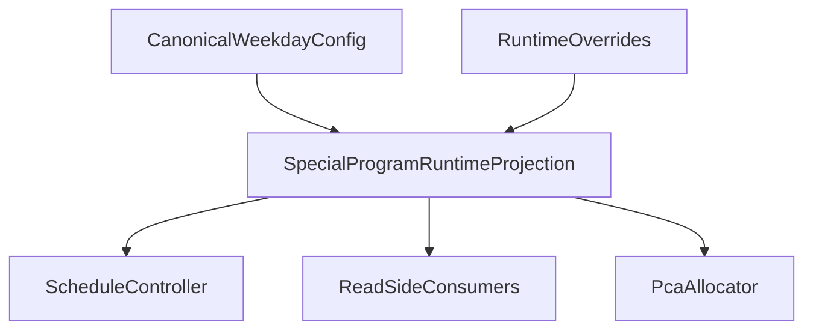

# WIP — Special Program Flow Hardening Review

**Last Updated**: 2026-03-12
**Status**: Bug chain fixed through export / secondary surface alignment. `F1` through `F9` are fixed and regression-tested. `P3` Slice 2 is complete, and Slice 3 has started with a first controller/runtime normalization pass.

---

## Why this exists

This file captures the special-program bug chain that was just debugged across:

- **Step 1** special-program availability semantics
- **Step 2.0** special-program override dialog seeding / runner selection
- **Step 2 allocation** therapist selection, PCA routing, and target-team derivation
- **Step 3 / pending math** special-program slot exclusion from general PCA capacity
- **Schedule-page display** special-program card styling, red-name treatment, and assigned-FTE counting

The main goal is to preserve:

1. **What failed**
2. **How each failure propagated downstream into wrong calculations**
3. **What has already been fixed**
4. **What still looks structurally fragile and should be refactored / hardened**

This file is both:

- a **review note** for future refactor work
- a **status tracker** for the current special-program hardening effort

---

## Observed Failure Chain

The bug that surfaced around Aggie / CRP was not one isolated defect. It was a **pipeline failure** where each stage trusted the output of the previous stage:

1. **Step 1 / availability semantics** could incorrectly hide or suppress the intended CRP runner
2. **Step 2.0 seeding** could revive stale `staffOverrides` fragments and pick the wrong runner anyway
3. **Step 2 allocation** could then route CRP PCA coverage to the wrong target team
4. **Step 3 / pending math** could count special-program slots inconsistently against general PCA capacity
5. **Schedule-page display** could still render the wrong slot/team as “special” because a different helper path still believed old CRP assumptions

That is why the user-visible symptom changed over time:

- first the runner was wrong
- then the runner became correct but the PCA target team was wrong
- then the target team became correct but the schedule card / assigned math was still wrong

This is the core architectural lesson: **special-program state is not safe unless the same effective program decision is reused all the way down the pipeline**.

---

## Main Risk Theme

The biggest remaining architectural risk is that the codebase still has **multiple definitions of “effective special-program state”**:

- raw dashboard `specialPrograms`
- normalized weekday config rows
- Step 2.0 override fragments in `staffOverrides`
- Step 2 runtime-adapted `modifiedSpecialPrograms`
- Step 3 slot-exclusion helpers
- schedule-page display helpers
- export-only mapping logic

When those paths drift, the system can enter a state where:

- Step 2 allocates using one slot/team interpretation
- Step 3 excludes capacity using another interpretation
- the schedule page renders a third interpretation

That is how a “UI bug” can become a **wrong PCA calculation bug**.

---

## Finding Index

| # | Severity | Area | Trigger Condition | Downstream Wrong-Calculation Impact | Status |
|---|---|---|---|---|---|
| F1 | **CRITICAL** | Step 1 / Step 2 runner availability semantics | A therapist is the canonical special-program runner, but legacy `specialProgramAvailable` or zero-FTE semantics suppress them | Wrong runner enters Step 2, so all downstream therapist/PCA/team decisions can start from the wrong source | **FIXED** |
| F2 | **CRITICAL** | Step 2.0 existing override seeding | `staffOverrides` contains stale special-program fragments from a previous runner | Step 2.0 loads the wrong therapist even though canonical weekday config says otherwise | **FIXED** |
| F3 | **CRITICAL** | Step 2 special-program PCA routing | Step 2 chooses the correct therapist runner, but PCA target team is still inferred from stale / non-explicit therapist tagging | Special-program PCA coverage is routed to the wrong team, reducing pending for the wrong team | **FIXED** |
| F4 | **HIGH** | Schedule-page display + assigned math | Allocation is correct, but display/count helpers still use hardcoded CRP slot/team assumptions | Special-program slot is counted as floating/general coverage, inflating `assigned` and rendering wrong card styling | **FIXED** |
| F5 | **CRITICAL** | Step 2.0 “Not running today” toggle | User disables a program in the dialog, but confirm emits no explicit “disabled” runtime state | Step 2/3 can still treat the program as active, reserving PCA capacity and distorting pending | **FIXED** |
| F6 | **HIGH** | Step 3 bootstrap slot exclusion | Step 3 rebuilds special-program slot sets from raw fields / stale fallback logic instead of canonical effective runtime state | Special-program coverage can be miscounted as ordinary team coverage, skewing pending before floating allocation starts | **FIXED** |
| F7 | **HIGH** | Display/read-side slot helpers | Display/count helpers read canonical weekday slots only, while capacity math reads Step 2 overrides too | Page rendering, drag protection, and capacity math can disagree on what slot is “special” | **FIXED** |
| F8 | **MEDIUM** | Step 3 reset / re-entry preservation | Re-entry occurs without a fresh explicit override fragment, especially for multi-team or non-primary-team preservation cases | Legitimate special-program slots can be stripped on reset, inflating later pending | **FIXED** |
| F9 | **MEDIUM** | Export / secondary display surfaces | Export/table code still carries old CRP/Robotic hardcoded slot-team assumptions | Exported schedule can diverge from live schedule and misrepresent special-program coverage | **FIXED** |

---

## Regression Results Convention

This WIP uses the following convention:

- **Each `F(N)` regression is cumulative at the time it is added**
- **When `F(N+1)` covers a later stage of the same bug chain, it becomes the authoritative latest result**
- Earlier `F` tests still remain useful as narrow guards, but the **latest higher-numbered test owns the newest truth** for overlapping behavior

Example:

- `F13` proved Step 2.0 seeding preferred the canonical therapist
- `F14` then proved downstream target-team routing respected that explicit therapist override
- `F15` and `F16` then became the latest confidence point for schedule-page slot/display correctness

So in the status sections below, the “Latest Result” line always points to the newest relevant `F` test, not the oldest one.

---

## Latest Regression Snapshot

**Ran on 2026-03-12**

- `tests/regression/f9-special-program-zero-fte-spt-runner.test.ts` — **PASS**
- `tests/regression/f10-crp-pca-target-follows-canonical-team.test.ts` — **PASS**
- `tests/regression/f11-special-program-capacity-uses-canonical-slots.test.ts` — **PASS**
- `tests/regression/f12-step1-special-program-availability-semantics.test.ts` — **PASS**
- `tests/regression/f13-crp-existing-override-prefers-canonical-therapist.test.ts` — **PASS**
- `tests/regression/f14-special-program-target-team-prefers-explicit-therapist-override.test.ts` — **PASS**
- `tests/regression/f15-special-program-display-slots-use-actual-program-slots.test.ts` — **PASS**
- `tests/regression/f16-special-program-slot-map-uses-actual-weekday-slots.test.ts` — **PASS**
- `tests/regression/f17-disabled-special-program-overrides-release-capacity.test.ts` — **PASS**
- `tests/regression/f18-step3-bootstrap-excludes-effective-special-program-slots.test.ts` — **PASS**
- `tests/regression/f19-special-program-display-respects-step2-overrides.test.ts` — **PASS**
- `tests/regression/f20-step3-reset-preserves-multi-team-special-program-slots.test.ts` — **PASS**
- `tests/regression/f21-export-special-program-labels-respect-runtime-slots.test.ts` — **PASS**
- `tests/regression/f22-special-program-runtime-model-slot-routing.test.ts` — **PASS**
- `tests/regression/f23-special-program-controller-runtime-helpers.test.ts` — **PASS**
- `tests/regression/f24-special-program-controller-runtime-state-bundle.test.ts` — **PASS**
- `tests/regression/f25-special-program-runtime-model-configured-target-team.test.ts` — **PASS**
- `tests/regression/f26-special-program-runtime-model-override-projection.test.ts` — **PASS**
- `tests/regression/f27-special-program-runtime-model-explicit-therapist.test.ts` — **PASS**
- `tests/regression/f28-special-program-runtime-model-drm-pca-override-semantics.test.ts` — **PASS**
- `tests/regression/f29-special-program-runtime-model-shared-allocation-identity.test.ts` — **PASS**
- `tests/regression/f30-special-program-runtime-model-allocator-default-target-team.test.ts` — **PASS**
- `tests/regression/f31-special-program-runtime-model-primary-target-pending-gate.test.ts` — **PASS**

**Current authoritative latest result**: `F31 PASS`  
This is the newest narrow regression in the current hardening sequence and should be read as the latest confidence point for the third `Slice 4` allocator migration pass.

---

## Refactor / Streamline Direction

Before the detailed findings, the clearest refactor target is:

### 1. One effective runtime special-program resolver

Introduce one shared runtime resolver that returns, per program and weekday:

- `enabled`
- `effectiveSlots`
- `effectiveTherapistId`
- `effectiveTherapistFteSubtraction`
- `effectivePrimaryPcaId`
- `effectiveManualPcaCovers`
- `effectiveTargetTeam`
- `reservedPcaFte`

Every read/write consumer should reuse this same runtime shape instead of re-deriving from:

- raw `specialPrograms`
- raw `program.slots`
- raw `special_program_ids`
- ad hoc `CRP` / `Robotic` branches

### 2. Explicit negative state, not “absence means disabled”

If a program is “not running today”, that should be persisted as explicit runtime state, not implied by “no override emitted”.

### 3. Remove remaining UI-only hardcoded mappings

Anything still saying:

- `CRP -> slot 2 -> CPPC`
- `Robotic -> slots 1/2 SMM, 3/4 SFM`

outside the canonical runtime resolver should be treated as a drift risk until proven otherwise.

---

## Detailed Findings

---

### F1 — CRITICAL: Runner availability semantics can suppress the canonical special-program runner

**Area**:

- Step 1 leave semantics
- Step 2.0 therapist availability filtering

**Trigger / how it can happen**:

- a therapist is the canonical weekday runner
- their `fte_subtraction` is `0` or their special-program participation is represented through normalized config rather than older assumptions
- legacy UI semantics or a sticky `specialProgramAvailable: false` interpret them as unavailable

**Wrong-processing chain**:

1. Step 1 / override semantics treat the runner as unavailable
2. Step 2.0 therapist pool excludes the runner
3. Step 2.0 auto-seeding picks a secondary therapist
4. therapist team assignment shifts
5. special-program PCA target team derives from the wrong therapist
6. Step 3 / schedule page inherit the wrong base state

**Why this becomes a wrong calculation, not just wrong UI**:

The therapist runner is part of the allocation input model.  
If the wrong runner is selected, the wrong team receives special-program PCA routing, so team assigned-FTE and pending-FTE become wrong downstream.

**Regression coverage**:

- `F9` — zero-subtraction CRP/SPT runner semantics
- `F12` — Step 1 special-program availability semantics

**Latest Result**:

- `F12 PASS`

**Implementation status**:

- Added / refined Step 1 availability semantics helpers
- Moved toward `undefined = no explicit override` instead of sticky false semantics
- Adjusted availability behavior so zero-FTE SPT runner cases like Aggie still surface correctly when the leave state is ambiguous rather than truly full-day absent

**Code-quality / streamline suggestion**:

- keep Step 1 and Step 2.0 reading the **same availability helper** instead of each embedding slightly different “can this therapist still run the slot?” logic

---

### F2 — CRITICAL: Existing override seeding can revive stale `staffOverrides` fragments and override the canonical runner

**Area**:

- Step 2.0 initialization / existing override seed construction

**Trigger / how it can happen**:

- a previous run or stale persisted state leaves `specialProgramOverrides` fragments on a different therapist or PCA
- Step 2.0 reconstructs the override state by scanning `staffOverrides`
- the seed path trusts that stale fragment over current canonical weekday config

**Wrong-processing chain**:

1. stale override fragment is found first
2. Step 2.0 initializes with the wrong therapist
3. user sees the wrong runner preloaded
4. if accepted, Step 2 allocation follows the wrong therapist/team
5. pending/capacity and schedule display drift from the actual intended weekday config

**Why this becomes a wrong calculation**:

This corrupts the **seed state** for the allocation flow.  
The wrong runner then becomes the authoritative source for downstream team routing.

**Regression coverage**:

- `F13` — CRP existing override prefers canonical therapist

**Latest Result**:

- `F13 PASS`

**Implementation status**:

- Added `lib/utils/specialProgramOverrideSeed.ts`
- Introduced canonicalization while seeding existing program overrides
- Special-cased CRP to prefer the current canonical weekday therapist when available

**Code-quality / streamline suggestion**:

- keep all “existing override seed” logic in one helper and avoid duplicating CRP-specific preference rules in UI components

---

### F3 — CRITICAL: Step 2 special-program PCA routing can ignore the explicit therapist decision and route coverage to the wrong team

**Area**:

- Step 2 PCA allocation target-team derivation

**Trigger / how it can happen**:

- Step 2.0 correctly chooses the therapist
- but target-team derivation still reads stale therapist tagging or fallback team logic
- PCA allocator routes the special-program PCA to a different team from the chosen therapist

**Wrong-processing chain**:

1. Step 2.0 therapist decision is correct
2. target-team derivation ignores or under-prioritizes that decision
3. PCA allocation assigns special-program slot(s) to the wrong team
4. wrong team’s assigned PCA FTE increases
5. wrong team’s pending PCA FTE decreases
6. later Step 3 runs from a distorted base state

**Why this becomes a wrong calculation**:

This is a direct team-accounting error:

- one team is credited with PCA coverage it should not own
- another team remains under-covered but hidden by routing drift

**Regression coverage**:

- `F10` — CRP PCA target follows canonical team
- `F14` — explicit therapist override drives target team

**Latest Result**:

- `F14 PASS`

**Implementation status**:

- Added `lib/utils/specialProgramTargetTeam.ts`
- Updated Step 2 routing to prioritize the explicit therapist override from Step 2.0 when deriving target team

**Code-quality / streamline suggestion**:

- any consumer needing “program target team” should read one shared helper instead of inferring from raw therapist allocations ad hoc

---

### F4 — HIGH: schedule display and assigned-FTE math can drift from the actual allocated special-program slots

**Area**:

- schedule-page card styling
- schedule-page assigned-PCA counting

**Trigger / how it can happen**:

- allocation is already correct
- but display/count code still uses older hardcoded CRP assumptions or raw slot fields
- the page treats a special-program slot as ordinary floating/general team coverage

**Wrong-processing chain**:

1. Step 2 allocation writes correct special-program slot/team
2. display helper still thinks CRP special slot is somewhere else
3. page fails to render special-program card styling
4. page counts that slot inside ordinary `assigned`
5. user sees inflated general PCA assignment and incorrect card semantics

**Why this becomes a wrong calculation**:

At this stage the bug is no longer just cosmetic.  
The page-level assigned summary is part of how users judge whether the schedule is balanced; if special-program slots are counted as general slots, the summary is mathematically misleading.

**Regression coverage**:

- `F15` — display slots use actual program slots
- `F16` — shared slot map preserves actual weekday slots

**Latest Result**:

- `F16 PASS`

**Implementation status**:

- Added `lib/utils/specialProgramDisplay.ts`
- Added `lib/utils/specialProgramSlotMap.ts`
- Removed stale CRP hardcoding from schedule-page helper paths that were part of this bug chain

**Code-quality / streamline suggestion**:

- do not allow any display surface to classify special-program slots from local hardcoded mappings; require one shared slot-map helper or runtime resolver

---

### F5 — CRITICAL: Step 2.0 “Not running today” can be UI-only and fail to mutate runtime allocation state

**Area**:

- Step 2.0 dialog disable flow
- runtime override application

**Trigger / how it can happen**:

- user disables a special program in the Step 2.0 dialog
- dialog clears local override state and skips emitting overrides
- runtime model interprets “no override” as “use original dashboard program as-is”

**Wrong-processing chain**:

1. user sees staff/slots visually released in the dialog
2. confirm emits no explicit disabled marker
3. allocation runtime still keeps the program active
4. Step 2 can still allocate for it
5. Step 3 capacity can still reserve PCA FTE for it
6. pending math becomes lower than it should be for general PCA coverage

**Why this becomes a wrong calculation**:

Special-program reserved capacity is subtracted from the general PCA pool.  
If a disabled program still reserves capacity, average/pending PCA calculations become systematically wrong.

**Regression coverage**:

- `F17` — disabled special-program override releases reserved capacity and beats stale active fragments

**Implementation status**:

- **FIXED**
- Step 2.0 confirm now emits an explicit `enabled: false` special-program override marker instead of encoding disablement as “no override emitted”
- Dialog initialization now rehydrates disabled programs from persisted override state, so reopening Step 2.0 matches the actual runtime state
- Shared runtime override summary logic now makes explicit disablement authoritative for Step 2 runtime program activation, Step 3 reservation slot resolution, reserved PCA capacity, and DRM add-on calculation

**Latest Result**:

- `F17 PASS`

**Code-quality / streamline suggestion**:

- keep future special-program runtime consumers reading the shared override summary so `enabled: false` remains one authoritative disabled-state signal

---

### F6 — HIGH: Step 3 bootstrap still has a separate stale slot-exclusion path

**Area**:

- Step 3 bootstrap / `existingTeamPCAAssigned` seed construction

**Trigger / how it can happen**:

- Step 2 already changed the effective slots through canonical runtime logic or overrides
- Step 3 rebuilds special-slot sets from raw `program.slots[weekday]` and local fallback rules

**Wrong-processing chain**:

1. Step 2 uses one effective slot set
2. Step 3 bootstrap excludes a different slot set from general coverage
3. `existingTeamPCAAssigned` is wrong before Step 3 allocation even begins
4. pending FTE is under- or over-estimated
5. floating PCA distribution starts from a distorted base

**Why this becomes a wrong calculation**:

This is a pure pending-math bug: special-program coverage can be credited to the ordinary team pool when it should remain reserved.

**Regression coverage**:

- `F18` — Step 3 bootstrap excludes canonical and Step 2 override-driven effective special-program slots from `existingTeamPCAAssigned`

**Implementation status**:

- **FIXED**
- Extracted Step 3 bootstrap seeding into `computeStep3BootstrapState()` so the pending seed logic is centralized instead of being inlined in the controller
- Step 3 bootstrap now reads `buildSpecialProgramSlotsByProgramId({ specialPrograms, weekday, staffOverrides })` instead of reconstructing slot sets from raw weekday fields plus CRP/Robotic fallback assumptions
- `buildSpecialProgramSlotsByProgramId()` now respects explicit Step 2 `requiredSlots` overrides and `enabled: false` disabled-program state, so Step 3 bootstrap aligns with the same runtime slot semantics already used by capacity/reservation logic

**Latest Result**:

- `F18 PASS`

**Code-quality / streamline suggestion**:

- continue moving read-side consumers onto the same override-aware slot-map helper so Step 3 bootstrap and schedule display cannot drift again

---

### F7 — HIGH: read-side helpers are override-blind while capacity math is override-aware

**Area**:

- schedule-page read helpers
- drag protection
- balance sanity checks
- capacity math

**Trigger / how it can happen**:

- Step 2.0 emits `requiredSlots` / PCA slot override decisions
- capacity math reads those overrides
- display helpers only read canonical weekday program slots

**Wrong-processing chain**:

1. one helper says a slot is reserved special-program capacity
2. another helper says the same slot is ordinary coverage
3. page-level assigned/balance/interaction logic drift apart

**Why this becomes a wrong calculation**:

The app can simultaneously:

- subtract reserved capacity correctly
- but still display or protect the wrong slot set

That is calculation / model drift even when the final numbers look close.

**Regression coverage**:

- `F19` — display helper respects Step 2 `requiredSlots` overrides for special-program slot classification

**Implementation status**:

- **FIXED**
- `getSpecialProgramSlotsForAllocationTeam()` now resolves slots through the shared override-aware slot-map helper instead of reading canonical weekday slots directly
- Schedule-page read-side consumers now pass `staffOverrides` / `baseOverrides` into slot classification so balance sanity checks, extra-coverage recomputation, and Step 3 dialog read paths stay aligned with override-aware reserved-capacity math
- `PCABlock` now builds its special-program slot map with `staffOverrides`, so card splitting and assigned-FTE display stay consistent with the same effective slot semantics

**Latest Result**:

- `F19 PASS`

**Code-quality / streamline suggestion**:

- keep pushing secondary read/display surfaces through the shared override-aware slot-map/display helpers so exports and reset preservation can reuse the same runtime definition

---

### F8 — MEDIUM: Step 3 reset / re-entry can strip legitimate special-program slots

**Area**:

- Step 3 cleanup / reset / re-entry preservation

**Trigger / how it can happen**:

- re-entry occurs after Step 2 allocations already exist
- no explicit fresh `specialProgramOverrides` fragment is available for reconstruction
- fallback preservation trusts only the allocation’s primary team view

**Wrong-processing chain**:

1. a legitimate special-program slot is not preserved
2. Step 3 reset removes it from preserved allocations
3. pending is recomputed as if that coverage vanished
4. later Step 3 stages may over-allocate to compensate

**Why this becomes a wrong calculation**:

Reset/re-entry is supposed to preserve authoritative Step 2 state.  
If preserved coverage is dropped, pending FTE is inflated and floating PCA allocation becomes too aggressive.

**Regression coverage**:

- `F20` — Step 3 reset preserves multi-team robotic special-program slots even when no fresh override fragment is present

**Implementation status**:

- **FIXED**
- `computeStep3ResetForReentry()` now accepts `specialPrograms` and `weekday` so reset preservation can read the same effective runtime slot map as the rest of the special-program pipeline
- Reset preservation now derives special-program slots from `buildSpecialProgramSlotsByProgramId({ specialPrograms, weekday, staffOverrides })` before falling back to local allocation shape
- This preserves non-primary-team / slot-team special-program coverage on re-entry instead of stripping it when `specialProgramOverrides` are absent

**Latest Result**:

- `F20 PASS`

**Code-quality / streamline suggestion**:

- keep reset/re-entry and export surfaces sharing the same override-aware slot-map helper so preserved state and derived display cannot diverge again

---

### F9 — MEDIUM: export / secondary display surfaces can still lag behind live schedule logic

**Area**:

- export tables
- secondary schedule views

**Trigger / how it can happen**:

- schedule page has already been fixed
- export helper still uses older CRP / Robotic hardcoded slot-team assumptions

**Wrong-processing chain**:

1. live schedule displays the correct special-program slot/team
2. export table classifies the same slot using old assumptions
3. exported artifact disagrees with live schedule

**Why this matters for calculation confidence**:

Even if export is not feeding allocation math back into the algorithm, it is still a **derived representation of assignment state**.  
If export disagrees with the live schedule, users lose confidence in the underlying numbers and may manually compensate for a bug that only exists in one surface.

**Regression coverage**:

- `F21 PASS`

**Implementation status**:

- **FIXED**
- `PCADedicatedScheduleTable` now resolves export slot labels through a shared helper instead of older `CRP` / `Robotic` hardcoded slot-team assumptions
- Export labeling now derives effective weekday slots from `buildSpecialProgramSlotsByProgramId({ specialPrograms, weekday, staffOverrides })`, so explicit Step 2 overrides and disabled-state semantics stay aligned with the live schedule
- This prevents export artifacts from disagreeing with the on-screen schedule when canonical slots are overridden or when legacy hardcoded mappings would have misclassified the assigned slot

**Recommended hardening**:

- make export surfaces consume the same shared special-program slot/classification helper as the live schedule page

---

## Implementation Status Summary

| Finding | Status | What has been done |
|---|---|---|
| F1 | **FIXED** | Availability semantics refined so zero-subtraction / zero-FTE SPT runner cases are not wrongly suppressed; Step 1 and Step 2 runner availability behavior hardened |
| F2 | **FIXED** | Existing override seeding now canonicalizes stale fragments toward the current weekday runner via shared seed helper |
| F3 | **FIXED** | Step 2 PCA routing now prefers explicit therapist override to derive special-program target team |
| F4 | **FIXED** | Schedule display/count helpers moved off stale CRP hardcoding onto shared actual-slot helpers |
| F5 | **FIXED** | Step 2.0 now emits explicit `enabled: false` disabled-program state, and shared runtime readers treat it as authoritative for allocation/capacity math |
| F6 | **FIXED** | Step 3 bootstrap now uses shared effective slot-map resolution, so designated special-program slots are excluded from `existingTeamPCAAssigned` consistently |
| F7 | **FIXED** | Override-aware slot classification is now centralized for the main read/display consumers via shared slot-map and display helpers |
| F8 | **FIXED** | Step 3 reset now preserves multi-team / non-primary-team special-program slots via the shared effective slot-map before falling back to local allocation shape |
| F9 | **FIXED** | Export dedicated schedule labeling now uses the same effective runtime slot resolution as the live schedule, removing stale CRP / Robotic hardcoding from the export path |

---

## Suggested Refactor Order

### P3 — cleanup / maintainability

1. Collapse remaining `CRP` / `Robotic` ad hoc branches into shared runtime utilities
2. Replace “derive again from raw program object” code paths with a single effective runtime special-program model

---

## P3 Runtime Model Design

### Why `P3` still matters after `F1`-`F9`

The concrete bugs in this chain are now fixed, but the remaining code shape still carries the same structural risk:

- one helper resolves **effective weekday slots**
- another helper resolves **effective target team**
- another path mutates the raw `SpecialProgram` object to simulate runtime state
- allocator logic still has embedded `CRP` / `Robotic` rules for slot-team routing and single-allocation behavior

That means future bugs are still likely to appear as **model drift**, where one layer is “correct” but another layer is quietly using a different interpretation of the same program/day.

### Existing shared building blocks

These utilities already represent the strongest current source-of-truth pieces:

- `lib/utils/specialProgramRuntimeOverrides.ts`
  - reduces `staffOverrides` into runtime override facts like `explicitlyDisabled`, `requiredSlots`, therapist/PCA override fragments, and DRM add-on state
- `lib/utils/specialProgramConfigRows.ts`
  - resolves canonical weekday program config from normalized `staff_configs` plus legacy fallback fields
- `lib/utils/specialProgramSlotMap.ts`
  - composes canonical weekday slot resolution with override-aware runtime slot precedence
- `lib/utils/specialProgramDisplay.ts`
- `lib/utils/specialProgramExport.ts`
  - downstream consumers already proving that read-side surfaces can share the same runtime slot logic

### Remaining duplication hotspots

The highest-value remaining consolidation targets are:

- `lib/algorithms/pcaAllocation.ts`
  - still carries the densest inline `program.name === 'Robotic' || program.name === 'CRP'` branching
  - special-program allocation identity, slot-team routing, and slot-derived PCA FTE semantics are still embedded directly in allocator flow
- `lib/features/schedule/controller/useScheduleController.ts`
  - `applySpecialProgramOverrides()` is effectively a runtime projection step, but it expresses that by mutating legacy `SpecialProgram`-shaped data instead of returning a pure runtime model
- `lib/utils/reservationLogic.ts`
  - still re-encodes special-program slot classification, including `Robotic` slot-team interpretation
- `lib/utils/specialProgramConfigRows.ts`
  - still contains fallback slot semantics and `CRP`-specific candidate ranking logic that are partly runtime-model concerns

### Proposed unified runtime projection

Add a pure helper, e.g. `lib/utils/specialProgramRuntimeModel.ts`, that resolves one authoritative runtime projection for:

- `program`
- `weekday`
- `staffOverrides`
- optional supporting context such as `allStaff` or already-resolved therapist allocations where needed

The projection should return data, not mutate program objects.

**Recommended core fields**:

- `isActiveOnWeekday`
  - final enabled / disabled state for the specific weekday, including explicit `enabled: false`
- `effectiveRequiredSlots`
  - final runtime slot set after applying Step 2 override precedence, canonical weekday config, and fallback semantics
- `slotTeamBySlot`
  - authoritative slot-to-team routing for special-program coverage, so downstream consumers no longer hardcode `Robotic` slot-team mapping
- `primaryTherapist`
  - resolved therapist identity plus final therapist FTE subtraction semantics for the day
- `targetTeam`
  - final program target team used by allocation and pending math
- `pcaRuntime`
  - grouped PCA-facing runtime facts such as reserved FTE, preferred/manual PCA covers, DRM add-on, and allocation scope (`single shared allocation` vs `per-team allocation`)

### Runtime projection data flow

### Migration boundaries

The intended rule for this refactor is:

- move **runtime-model rules** into the shared runtime projection
- keep **UI-only policy / presentation** in the dialog and dashboard components

**Should move into shared runtime utilities**:

- effective weekday activity / disablement
- effective slot resolution
- slot-to-team routing
- target-team routing
- allocation identity rules for special programs
- slot-derived vs config-derived PCA FTE semantics

**Should remain UI-specific**:

- dropdown ordering and display heuristics in `components/allocation/SpecialProgramOverrideDialog.tsx`
- render-only copy, labels, and conditional presentation
- non-runtime editing affordances that do not affect allocation semantics

### Planned rollout by slice

**Slice 1 — document the runtime model**

- write this design into the review doc
- define the shared runtime projection fields and migration boundaries
- treat current `applySpecialProgramOverrides()` behavior as the reference semantics to preserve

**Slice 2 — migrate read-only consumers first**

- move `reservationLogic`, display helpers, and export helpers onto the projection
- remove duplicate weekday-activity and slot-team interpretation from these paths first

**Slice 3 — normalize controller/runtime orchestration**

- replace controller-side special-program runtime mutation with projection-building plus thin adaptation where legacy shapes are still needed

**Slice 4 — migrate allocator last**

- move allocator routing and allocation-identity behavior onto the projection only after narrower read-side consumers are stable
- this is intentionally last because it is the highest-risk area for pending FTE, slot occupancy, and duplicate-assignment regressions

### P3 implementation progress

**Slice 1 status**: **DONE**

- Added this `P3 Runtime Model Design` section to document the proposed unified runtime projection
- Defined the initial projection contract (`isActiveOnWeekday`, `effectiveRequiredSlots`, `slotTeamBySlot`, `primaryTherapist`, `targetTeam`, `pcaRuntime`)
- Recorded the migration boundary between shared runtime-model rules and UI-only behavior

**Slice 2 status**: **DONE**

Completed so far:

- Added `lib/utils/specialProgramRuntimeModel.ts` as the first minimal runtime projection helper
- Implemented the first projection fields needed for read-only consumers:
  - `isActiveOnWeekday`
  - `effectiveRequiredSlots`
  - `slotTeamBySlot`
  - `targetTeam`
- Migrated `lib/utils/reservationLogic.ts` to consume the runtime projection instead of duplicating:
  - override-aware effective slot resolution
  - hardcoded `Robotic` slot-team routing
- Migrated `lib/utils/specialProgramExport.ts` to consume the runtime projection for weekday activity, effective slots, and slot-team validation
- Migrated `lib/utils/specialProgramDisplay.ts` to consume the runtime projection for weekday activity, effective slots, and slot-team validation
- Added `F22` regression coverage for runtime-model slot routing:
  - `tests/regression/f22-special-program-runtime-model-slot-routing.test.ts`

Verification completed for `Slice 2`:

- `F19 PASS`
- `F21 PASS`
- `F22 PASS`
- `F7 PASS`
- `F8 PASS`

`Slice 2` completion note:

- The main read-only consumers identified in the design pass are now on the shared runtime projection.
- The next duplication hotspots are no longer in read-only helpers; they are now primarily in controller orchestration and allocator behavior.

**Slice 3 status**: **DONE**

Completed so far in iteration 1:

- Added `lib/utils/specialProgramControllerRuntime.ts` as a shared controller-facing helper layer
- Moved controller-side `applySpecialProgramOverrides()` out of `useScheduleController.ts` into the shared helper
- Moved controller-side `buildSpecialProgramTargetTeamById()` out of `useScheduleController.ts` into the shared helper
- `applySpecialProgramOverrides()` now reads weekday activity through `resolveSpecialProgramRuntimeModel()` while still emitting the legacy adapted-program shape that the current allocator expects
- `resolveSpecialProgramTargetTeam()` now derives explicit therapist overrides through `getSpecialProgramRuntimeOverrideSummary()` instead of rescanning raw override fragments independently
- Added `F23` regression coverage for this first controller/runtime extraction:
  - `tests/regression/f23-special-program-controller-runtime-helpers.test.ts`

Verification completed for `Slice 3` iteration 1:

- `F14 PASS`
- `F17 PASS`
- `F21 PASS`
- `F22 PASS`
- `F23 PASS`

Completed so far in iteration 2:

- Added `buildSpecialProgramControllerRuntimeState()` to `lib/utils/specialProgramControllerRuntime.ts`
- `Step 3` now consumes `specialPrograms` and `specialProgramTargetTeamById` together through one shared controller-runtime helper instead of deriving them in two separate controller passes
- `Step 2` still needs a pre-therapist adapted-program pass before therapist allocation runs, but now reuses the same bundled controller-runtime helper for the post-therapist target-team stage once therapist allocations exist
- `buildSpecialProgramTargetTeamById()` now skips disabled / inactive programs when producing target-team routing, keeping controller target-team state aligned with the same runtime weekday-activity semantics used elsewhere
- Added `F24` regression coverage for the bundled controller runtime state:
  - `tests/regression/f24-special-program-controller-runtime-state-bundle.test.ts`

Verification completed for `Slice 3` iteration 2:

- `F14 PASS`
- `F21 PASS`
- `F22 PASS`
- `F23 PASS`
- `F24 PASS`

Completed so far in iteration 3:

- `resolveSpecialProgramRuntimeModel()` now exposes `configuredPrimaryTherapistId` and `configuredFallbackTargetTeam`
- The runtime model can now express the configured therapist-driven fallback team directly when given the effective therapist staff lookup for the weekday
- `buildSpecialProgramTargetTeamById()` now consumes `runtimeModel.configuredFallbackTargetTeam` instead of separately calling back into controller-local therapist-team fallback resolution
- This moves one more piece of target-team derivation out of controller orchestration and into the shared runtime model layer without changing allocator behavior
- Added `F25` regression coverage for runtime-model configured therapist / fallback-team projection:
  - `tests/regression/f25-special-program-runtime-model-configured-target-team.test.ts`

Verification completed for `Slice 3` iteration 3:

- `F14 PASS`
- `F22 PASS`
- `F24 PASS`
- `F25 PASS`

Completed so far in iteration 4:

- `resolveSpecialProgramRuntimeModel()` now exposes controller-facing override payloads:
  - `therapistOverrides`
  - `pcaOverrides`
  - `hasExplicitRequiredSlotsOverride`
- `applySpecialProgramOverrides()` now consumes those runtime-model fields instead of reparsing raw override fragments through a second controller-local summary call
- This reduces one more competing definition of “effective special-program runtime state” on the controller adaptation path while preserving the distinction between explicit Step 2 required-slot overrides and canonical weekday slots
- Added `F26` regression coverage for runtime-model override projection:
  - `tests/regression/f26-special-program-runtime-model-override-projection.test.ts`

Verification completed for `Slice 3` iteration 4:

- `F22 PASS`
- `F23 PASS`
- `F24 PASS`
- `F25 PASS`
- `F26 PASS`

Completed so far in iteration 5:

- `resolveSpecialProgramRuntimeModel()` now exposes `explicitOverrideTherapistId`
- `buildSpecialProgramTargetTeamById()` no longer depends on the separate `resolveSpecialProgramTargetTeam()` override-reading path; it now resolves explicit-override therapist routing directly from the shared runtime projection plus therapist allocations
- Tagged-allocation fallback remains in the controller helper, but the explicit-override branch now comes from the same runtime-model projection as the rest of the special-program controller state
- Added `F27` regression coverage for runtime-model explicit therapist projection:
  - `tests/regression/f27-special-program-runtime-model-explicit-therapist.test.ts`

Verification completed for `Slice 3` iteration 5:

- `F14 PASS`
- `F24 PASS`
- `F25 PASS`
- `F26 PASS`
- `F27 PASS`

Completed so far in iteration 6:

- `resolveSpecialProgramRuntimeModel()` now exposes `acceptsPcaCoverOverrides`, so DRM PCA-cover suppression semantics live in the shared runtime projection instead of a controller-local raw-name branch
- `applySpecialProgramOverrides()` now consumes `runtimeModel.acceptsPcaCoverOverrides` and no longer branches on raw `program.name === 'DRM'`
- Deleted the now-dead `lib/utils/specialProgramTargetTeam.ts` helper after removing its last controller/runtime caller path
- Final controller audit confirmed:
  - no remaining `CRP` / `Robotic` / `DRM` raw-name branches in `useScheduleController.ts`
  - no remaining `resolveSpecialProgramTargetTeam()` callers in `lib/`
  - controller-side special-program interpretation now flows through `specialProgramControllerRuntime.ts` + `specialProgramRuntimeModel.ts`
- Added `F28` regression coverage for DRM PCA-cover override projection:
  - `tests/regression/f28-special-program-runtime-model-drm-pca-override-semantics.test.ts`

Verification completed for `Slice 3` iteration 6:

- `F24 PASS`
- `F26 PASS`
- `F27 PASS`
- `F28 PASS`

`Slice 3` completion note:

- The remaining special-program duplication hotspots are no longer in controller/runtime orchestration.
- The substantial remaining hardcoded `CRP` / `Robotic` behavior is now concentrated in allocator paths (`lib/algorithms/pcaAllocation.ts`) and canonical-config utilities (`lib/utils/specialProgramConfigRows.ts`), which is the intended boundary for `Slice 4`.

**Slice 4 status**: **IN PROGRESS**

Completed so far in iteration 1:

- `resolveSpecialProgramRuntimeModel()` now exposes `usesSharedAllocationIdentity`, so the “single shared special-program allocation vs per-team allocation” rule is projected from the shared runtime model instead of being redefined ad hoc inside allocator branches
- `lib/algorithms/pcaAllocation.ts` now consumes that runtime-model flag for the repeated shared-allocation checks that previously hardcoded `program.name === 'Robotic' || program.name === 'CRP'`
- The same allocator pass now also consumes the shared-allocation flag for its existing “use full slot FTE for shared special-program coverage” branches, preserving current allocator semantics while removing another parallel raw-name rule
- Added `F29` regression coverage for runtime-model shared-allocation identity:
  - `tests/regression/f29-special-program-runtime-model-shared-allocation-identity.test.ts`

Verification completed for `Slice 4` iteration 1:

- `F2 PASS`
- `F10 PASS`
- `F28 PASS`
- `F29 PASS`

`Slice 4` iteration 1 note:

- The allocator no longer repeats the `Robotic` / `CRP` shared-allocation identity rule inline across its dense assignment branches.
- The remaining `Slice 4` work is now narrower: move allocator slot-team routing and target-team derivation off the remaining local helpers (`getSlotTeamForSpecialProgram()` and `resolveTargetTeamsForSpecialProgram()`) and onto the shared runtime projection.

Completed so far in iteration 2:

- `resolveSpecialProgramRuntimeModel()` now exposes `allocatorDefaultTargetTeam`, preserving the allocator’s existing routing precedence in one shared place:
  - explicit controller-provided target team first
  - configured therapist fallback team next when available
  - legacy CRP fallback to `CPPC` last
  - Robotic defaults to its first routed slot team (`SMM`)
- `resolveTargetTeamsForSpecialProgram()` in `lib/algorithms/pcaAllocation.ts` now consumes shared runtime-model routing facts instead of branching directly on raw `program.name === 'Robotic'` / `program.name === 'CRP'`
- `getSlotTeamForSpecialProgram()` in `lib/algorithms/pcaAllocation.ts` now resolves slot-team routing through `runtimeModel.slotTeamBySlot` + `runtimeModel.allocatorDefaultTargetTeam` instead of re-encoding the Robotic slot map locally
- Added `F30` regression coverage for allocator-default target-team projection:
  - `tests/regression/f30-special-program-runtime-model-allocator-default-target-team.test.ts`

Verification completed for `Slice 4` iteration 2:

- `F10 PASS`
- `F22 PASS`
- `F29 PASS`
- `F30 PASS`

`Slice 4` iteration 2 note:

- Allocator slot-team routing and shared-target-team fallback no longer depend on the old allocator-local raw-name helpers.
- The remaining `Slice 4` work is now mostly at the “allocator semantics still embedded in control flow” layer rather than the “allocator owns its own routing model” layer.

Completed so far in iteration 3:

- `resolveSpecialProgramRuntimeModel()` now exposes `bypassesPrimaryTargetPendingGate`, projecting the remaining allocator rule that Robotic coverage should still run even when the primary routed target team itself no longer has pending FTE
- `lib/algorithms/pcaAllocation.ts` now consumes that runtime-model flag for the Step 2 special-program `neededFTE <= 0` gate instead of branching on raw `program.name !== 'Robotic'`
- Added `F31` regression coverage for this remaining allocator control-flow rule:
  - `tests/regression/f31-special-program-runtime-model-primary-target-pending-gate.test.ts`

Verification completed for `Slice 4` iteration 3:

- `F10 PASS`
- `F29 PASS`
- `F30 PASS`
- `F31 PASS`

`Slice 4` iteration 3 note:

- The active special-program allocator path no longer contains raw `CRP` / `Robotic` name branches for allocation identity, target-team routing, slot-team routing, or the primary-target pending gate.
- The only remaining raw-name allocator branch in the active path is the intentional DRM skip (`DRM` has no designated PCA staff). The older commented legacy block still contains historical raw-name logic, but it is not executed.

### Verification strategy for `P3`

`P3` should be protected by narrow regressions, not one large rewrite test.

Before touching allocator behavior, keep the current confidence chain intact:

- preserve `F17` through `F21`
- add helper-level coverage for the new runtime projection
- add targeted allocator regressions for:
  - special-program slot-team routing
  - single shared allocation vs per-team allocation identity
  - pending-FTE impact when special-program slots are already occupied

### Recommended next implementation step from current state

`Slice 3` is complete.

The safest next code step is:

1. continue `Slice 4` with allocator slot-team / target-team migration
2. decide whether to leave the active DRM skip as an explicit allocator policy or project that last program-level allocator rule into the runtime model for full consistency
3. preserve the current allocator confidence chain (`F2`, `F10`, `F22`, `F29`, `F30`, `F31`) while keeping the controller/runtime chain (`F24`-`F28`) green

That preserves the now-stabilized controller/runtime layer while moving the remaining risk into the intended final migration boundary.

---

## P4 — Unified Allocation Runtime Projection

### Why `P4` is the right next layer after `P3`

`P3` and `Slice 4` have moved most special-program semantics onto `resolveSpecialProgramRuntimeModel()`, but the broader schedule pipeline still has the same structural split:

- editable state lives across baseline snapshot data, `staffOverrides`, and per-step workflow state
- each downstream consumer still builds its own partial runtime interpretation of that state

The special-program hardening work shows that this pattern is where drift comes from. The next risk is no longer just “special program bugs”; it is **runtime interpretation drift** across:

- therapist allocation
- PCA allocation
- Step 3 reservation/bootstrap logic
- display/export/read-side helpers

### Core principle

The app should keep the current architecture distinction:

- **editable source state**
  - baseline snapshot
  - `staffOverrides`
  - workflow / step state
- **derived runtime projection**
  - pure interpretation of the above for one date / weekday

`P4` should therefore **not** make the runtime projection the writable source of truth.

Instead, `P4` should make the runtime projection the **single semantic interpreter** of schedule state.

That means:

- edits still write to baseline snapshot and `staffOverrides`
- downstream consumers stop re-deriving meaning from raw partial objects
- allocators, reservation logic, and display/export all read shared projected facts

### Proposed final shape

Add one schedule-level projection layer, e.g. `ScheduleRuntimeProjection`, that is built from:

- `selectedDate`
- `baselineSnapshot`
- `staffOverrides`
- live team settings / merge settings already applied for the schedule date
- optional prior-step results where needed (for example therapist allocations when building PCA-facing views)

Recommended top-level sections:

- `meta`
  - `date`
  - `weekday`
  - `currentStep`
  - snapshot / workflow versioning metadata if useful for diagnostics only
- `staffById`
  - final per-staff runtime state after leave/FTE/team/day overrides are applied
- `specialProgramsById`
  - shared per-program runtime projection (today’s `SpecialProgramRuntimeModel`, expanded as needed)
- `teamRuntime`
  - derived per-team facts needed by allocators / reservation logic
- `views`
  - thin consumer-facing selectors / adapter outputs derived from the same projection instead of each subsystem re-reading raw state

### `staffById` runtime entry

This is the missing bridge between `staffOverrides` and allocator/read-side consumers.

Recommended fields:

- identity / static shape
  - `staffId`
  - `name`
  - `rank`
  - `baseTeam`
- effective daily assignment state
  - `effectiveTeam`
  - `leaveType`
  - `fteRemaining`
  - `isOnDuty`
  - `availableSlots`
  - `invalidSlots`
- therapist-facing runtime facts
  - `specialProgramAvailable`
  - `amPmSelection`
  - `therapistManualSplits`
  - `therapistNoAllocation`
- PCA-facing runtime facts
  - `floating`
  - `floorPcaSelection`
  - substitution / slot override facts
  - preserved special-program slot occupancy / blocked-slot reasons where relevant
- diagnostics
  - optional `sourceFlags` showing which facts came from baseline vs override vs step-derived state

This lets leave/FTE edits participate in the same runtime projection instead of being re-read ad hoc from `staffOverrides` in multiple places.

### `specialProgramsById` runtime entry

`resolveSpecialProgramRuntimeModel()` should remain the seed for this section, but `P4` should treat it as a nested component of the larger schedule runtime projection.

Recommended fields:

- weekday activity
  - `isActiveOnWeekday`
  - explicit disablement state
- therapist routing
  - configured primary therapist
  - explicit override therapist
  - configured fallback target team
  - final effective target team
- slot semantics
  - `effectiveRequiredSlots`
  - `slotTeamBySlot`
- PCA semantics
  - `acceptsPcaCoverOverrides`
  - `usesSharedAllocationIdentity`
  - `bypassesPrimaryTargetPendingGate`
  - `allocatorDefaultTargetTeam`
  - whether the program participates in dedicated PCA allocation vs add-on-only behavior (this is where the remaining DRM allocator skip should ultimately live)
- override payloads
  - therapist overrides
  - PCA overrides
  - explicit required-slot override flag

### `teamRuntime`

This section should centralize team-level facts that are currently recomputed in many places.

Recommended fields:

- `effectiveTeamOrder`
- merged-team / display-team resolution
- per-team therapist FTE after runtime adjustments
- per-team PCA requirement inputs
- per-team reserved special-program PCA burden
- per-team pending FTE snapshots used by Step 3 / reservation logic

This should not replace allocator result state; it should provide the shared team facts that allocators consume before and between steps.

### Consumer views derived from one projection

To keep the runtime object from becoming a giant “god object”, downstream systems should consume focused selectors built from the shared projection.

Recommended views:

- `buildTherapistAllocatorView(projection)`
  - returns exactly the therapist allocator input shape, but sourced from runtime staff/program facts rather than scattered raw reads
- `buildPcaAllocatorView(projection, therapistResult)`
  - returns effective special-program routing, candidate PCA availability, blocked slots, and team requirement inputs from one place
- `buildReservationView(projection, step3State)`
  - returns the Step 3 reservation/bootstrap input without independently recalculating special-program occupancy
- `buildDisplayView(projection)`
  - powers schedule-page/export/read-only classification

The rule should be:

- consumers may adapt the shared projection into their local input shape
- consumers should not reinterpret raw state directly

### What should remain source state vs projection

Keep as editable source state:

- baseline snapshot
- `staffOverrides`
- step dialogs’ explicit user choices
- saved allocator results / workflow state

Move into shared runtime interpretation:

- leave/FTE daily availability semantics
- team override + slot availability meaning
- special-program weekday activity / target-team / slot-team meaning
- dedicated-PCA vs add-on-only program participation rules
- blocked-slot / reserved-capacity / shared-allocation semantics

### Recommended rollout

`P4` should be design-first and incremental:

1. **P4.1 — formalize `staffById` runtime entries**
   - centralize leave/FTE/team/availability interpretation
2. **P4.2 — add consumer views**
   - therapist allocator and PCA allocator read selectors from the same projection
3. **P4.3 — migrate reservation/bootstrap**
   - Step 3 bootstrap/reservation uses runtime team + slot occupancy facts only
4. **P4.4 — finish read-side parity**
   - display/export/debug helpers consume the same schedule-level projection
5. **P4.5 — remove legacy adapted raw-object flows**
   - eliminate remaining “mutate `SpecialProgram` shape to simulate runtime state” patterns

#### P4.1 progress (2026-03-13)

- Added `lib/utils/staffRuntimeProjection.ts` with `buildStaffRuntimeById()` plus normalization helpers (`deriveEffectiveInvalidSlot`, `normalizeAvailableSlotsWithInvalidAndSubstitution`) to make per-staff daily runtime semantics explicit and reusable.
- Migrated Step 2 and Step 3 PCA pool construction in `useScheduleController` to consume `staffById` runtime entries instead of duplicating invalid-slot / substitution-slot / FTE interpretation logic inline.
- Save path now falls back to runtime-derived `effectiveInvalidSlot` (including `invalidSlots[]`-only overrides) when building persisted PCA rows, reducing legacy `invalidSlot` drift.
- Added regression `tests/regression/f32-staff-runtime-projection-normalization.test.ts` for invalid-slot derivation + slot normalization behavior.

#### P4.2 progress (2026-03-13)

- Added `lib/utils/scheduleRuntimeProjection.ts` with `buildScheduleRuntimeProjection()` and selector-style consumer views:
  - `buildTherapistAllocatorView(projection, sptWeekdayByStaffId)`
  - `buildPcaAllocatorView(projection, options)`
- Step 2 now builds one shared runtime projection and sources both therapist allocator input (`StaffData[]`) and PCA allocator input (`PCAData[]`) from these selectors.
- Step 3 now also sources floating PCA allocator input from the same projection/view path (with Step 3 substitution-slot exclusion and buffer clamp options).
- Added regression `tests/regression/f33-schedule-runtime-views-use-shared-projection.test.ts` to assert therapist + PCA views read consistent team/FTE/slot semantics from one projection.

#### P4.3 progress (2026-03-13)

- Added `lib/utils/scheduleReservationRuntime.ts` as a shared runtime reservation interpreter for special-program slot occupancy:
  - `buildReservationRuntimeProgramsById(...)`
  - `isAllocationSlotFromSpecialProgram(...)`
  - `getAllocationSpecialProgramNameForSlot(...)`
- Migrated `lib/features/schedule/step3Bootstrap.ts` to consume this shared runtime occupancy view (slot + team aware) instead of per-program raw slot-set exclusion.
- Migrated Step 3.3 logic in `lib/utils/reservationLogic.ts` to the same runtime occupancy interpreter for:
  - identifying whether a slot is truly special-program-assigned
  - deriving the corresponding special-program display name
- Added regression `tests/regression/f34-reservation-bootstrap-use-slot-team-runtime-occupancy.test.ts` to lock slot-team-aware occupancy behavior for Step 3 bootstrap + Step 3.3 adjacent reservation.

#### P4.4 progress (2026-03-13)

- Extended `lib/utils/scheduleRuntimeProjection.ts` with a read-side `buildDisplayView(...)` / `buildDisplayViewForWeekday(...)` projection that caches runtime program interpretations by allocation target team.
- Added read-side runtime helpers in `lib/utils/scheduleReservationRuntime.ts`:
  - `getAllocationSpecialProgramSlotsForTeam(...)`
  - `getAllocationSpecialProgramNamesBySlot(...)`
- Migrated display/export read paths to shared projection-backed runtime facts:
  - `lib/utils/specialProgramDisplay.ts`
  - `lib/utils/specialProgramExport.ts`
- Added regression `tests/regression/f35-read-side-display-export-share-runtime-occupancy.test.ts` to keep display and export slot classification aligned on the same slot-team-aware runtime occupancy semantics.

#### P4.5 progress (2026-03-13)

- Removed remaining slot-set adaptation paths in active schedule flows and switched them to slot-team-aware runtime occupancy checks:
  - `lib/features/schedule/stepReset.ts`
  - `app/(dashboard)/schedule/page.tsx` (Step 3 dialog pending-cap view + extra-coverage recompute)
  - `components/allocation/PCABlock.tsx`
- Rebased `lib/utils/specialProgramSlotMap.ts` to use the reservation runtime interpreter (`buildReservationRuntimeProgramsById`) as a compatibility adapter, so legacy callers no longer derive slots from raw override/config branches.
- Net effect: special-program occupancy classification now consistently comes from shared runtime projection helpers, rather than per-consumer raw slot-set reconstruction.

### Recommendation from current state

Yes: `P4` should become the next explicit workstream.

The recommended architecture is:

- `staffOverrides` + leave/FTE edits + baseline snapshot remain the editable source state
- one shared schedule runtime projection interprets them
- therapist allocator, PCA allocator, reservation logic, display/export all consume that projection
- no downstream layer infers semantics directly from raw program names or partial raw objects

That preserves the existing three-layer architecture while finally giving the schedule pipeline one semantic source of truth.

---

## Future Test Additions

These are the highest-value missing regressions:

1. **Disabled program end-to-end**
   - Step 2.0 marks program not running
   - Step 2 allocation skips it
   - reserved PCA capacity excludes it
   - schedule page shows no special-program coverage for it

2. **Override-aware read path**
   - Step 2.0 `requiredSlots` override changes effective slot set
   - Step 3 bootstrap, schedule page, drag protection, and assigned math all agree on the same slot set

3. **Reset / re-entry preservation**
   - Step 2 special-program allocation exists
   - Step 3 reset/re-entry occurs
   - preserved special-program slots remain intact

4. **Export parity**
   - live schedule and export table classify the same special-program slot identically

---

## Bottom Line

The special-program bug chain is now fixed at the concrete failure points that affected Aggie / CRP:

- canonical runner selection
- stale override seeding
- target-team routing
- schedule-page special-program display / assigned math

But the review strongly suggests the app still needs one more round of hardening:

- **not just more bug fixes**
- but a **single shared effective special-program runtime model**

Without that refactor, the next bug is likely to be another version of the same problem:  
one layer will be “correct”, but another layer will still be reading a different definition of the same special-program state.
