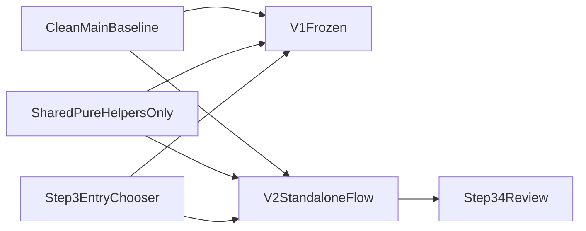

# Step 3 V1/V2 Recovery Plan

Status: approved recovery direction

Date: 2026-04-07

## Related documents (what each is for)

Read in this order when planning or implementing; do not load every file into context for every step.

### `docs/superpowers/plans/2026-04-07-step3-v2-messy-snapshot-handoff.md`

**Purpose:** Explains why `backup/step3-ranked-slot-v2-snapshot` exists, what went wrong, and safe git workflow for the next machine.

**Use when:** Onboarding or handing off; deciding whether you are on reference snapshot vs clean recovery branch.

### `docs/superpowers/plans/2026-04-06-floating-pca-ranked-slot-step3.md`

**Purpose:** Original ranked-slot implementation plan (Tasks 1-6), file map, regression and smoke test names.

**Use when:** Executing feature work on a **clean** branch after recovery boundaries are in place; reconcile with this recovery doc if steps conflict.

### `docs/superpowers/specs/2026-04-06-floating-pca-ranked-slot-allocation-design.md`

**Purpose:** Allocator policy: ranked slot ladder, pending-first, continuity, duplicate/gym rules, tracker semantics.

**Use when:** Editing `pcaAllocationFloating.ts`, `floatingPCAHelpers.ts`, or allocation-related types/tests.

### `docs/superpowers/specs/2026-04-06-floating-pca-step3-ui-design.md`

**Purpose:** Product UI and copy for Step 3 family and dashboard ranked slots (exception step, final review, plain language).

**Use when:** Editing Step 3 dialogs, cards, or `PCAPreferencePanel`; wording and flow authority over the HTML mock.

### `.superpowers/brainstorm/96515-1775525468/content/step3-family-preview-v2.html`

**Purpose:** Visual/layout reference only (static mock in browser).

**Use when:** Matching layout of strips, detail block, and explanation panel; reimplement in React with project components.

## Goal
Restore a clean, untouched V1 Step 3 from `main`, then rebuild V2 as a separate ranked-slot workflow that matches the approved design and does not contaminate V1 state, navigation, or save behavior.

## Why The Current Branch Drifted
The current worktree mixed V2 into the existing wizard instead of isolating it:
- `components/allocation/FloatingPCAConfigDialog.tsx` now owns both V1 and V2 concerns.
- `app/(dashboard)/schedule/page.tsx` contains duplicated Step 3 orchestration for auto/dev flows.
- `lib/algorithms/pcaAllocationFloating.ts` and tracker types are being used by a shared dialog instead of a standalone V2 flow.
- The approved UI in `.superpowers/brainstorm/96515-1775525468/content/step3-family-preview-v2.html` was only partially translated, so the live Step 3.4 review diverged into a raw diagnostic table.

## Recovery Strategy
Use a fresh recovery worktree from `main` and treat the current dirty worktree only as a reference source.

## Implementation Phases

### 1. Freeze the baseline
- Create a new recovery worktree from `main` / current clean `HEAD`, not from `.worktrees/step3-ranked-slot-v2`.
- Confirm V1 baseline behavior from the clean sources in:
  - `components/allocation/FloatingPCAConfigDialog.tsx`
  - `app/(dashboard)/schedule/page.tsx`
  - `lib/algorithms/pcaAllocation.ts`
  - `lib/features/schedule/controller/useScheduleController.ts`
- Keep that baseline untouched except for adding a top-level Step 3 entry choice.

### 2. Split the Step 3 UI boundary before `3.1`
- Replace the in-wizard engine toggle with a pre-Step-3.1 launcher in the Step 3 entry surface.
- New boundary:
  - `FloatingPCAEntryDialog` or equivalent launcher: choose `V1 legacy` vs `V2 ranked`
  - `FloatingPCAConfigDialogV1`: clean legacy wizard, no V2 preview/review logic
  - `FloatingPCAConfigDialogV2`: ranked-slot wizard with its own `3.1 -> 3.2 -> 3.3 -> 3.4` path rules
- `app/(dashboard)/schedule/page.tsx` should route into one flow or the other explicitly; no shared mutable step-machine with engine branching inside it.

### 3. Rebuild V2 orchestration as a standalone path
- Move V2-only orchestration out of the shared dialog into dedicated V2 helpers/components.
- Keep sharing only pure logic where behavior is identical, such as ranked-slot helper functions and deterministic tracker formatting.
- Eliminate duplicated Step 3 flow logic between the V2 dialog and any auto/dev path in `app/(dashboard)/schedule/page.tsx`; one V2 orchestration path should own:
  - Step 3.1 preview
  - Step 3.2 exception preview
  - Step 3.3 adjacent options
  - Step 3.4 review-before-save

### 4. Rebuild V2 Step 3.1-3.3 to the approved shell
- Use `docs/superpowers/plans/2026-04-06-floating-pca-ranked-slot-step3.md` and `.superpowers/brainstorm/96515-1775525468/content/step3-family-preview-v2.html` as the source of truth.
- Step 3.1:
  - keep team strip and scarcity preview
  - remove the current mixed allocation-engine/legacy mode card from inside the wizard
- Step 3.2:
  - show only exception teams needing review
  - add focused explanation card with system plan copy
- Step 3.3:
  - keep adjacent help as a short optional step with clear focused-team explanation
- Navigation must be path-aware: if `3.2` was skipped, `3.3` goes back to `3.1`, not a phantom `3.2`.

### 5. Rebuild V2 Step 3.4 review exactly around the approved mental model
- Render the selected-team detail block from tracker/result view-models, not raw slot ids.
- Required V2 Step 3.4 outputs:
  - time ranges, not slot numbers
  - readable labels: `1st choice`, `2nd choice`, `Other`, `Gym`
  - connected detail block tied visually to the selected team
  - plain-language outcome states like `Floor PCA fallback`, `Preferred PCA used`, `Unused`, `Gym avoided`
  - `Why this happened` explanation list built from tracker diagnostics
- Likely files:
  - `components/allocation/FloatingPCAConfigDialogV2.tsx`
  - extracted V2 review components such as `Step34ReviewPanel.tsx` / `Step34ResultBox.tsx`
  - tracker reason/view-model helpers near `lib/utils/floatingPCAHelpers.ts`

### 6. Preserve save/persistence isolation
- V1 save path remains exactly as today.
- V2 save path may continue to use tracker and ranked-slot diagnostics, but it must not backflow V2-only state into V1 runtime assumptions.
- Audit save and runtime coupling in:
  - `app/(dashboard)/schedule/page.tsx`
  - `types/schedule.ts`
  - `lib/utils/floatingPCAHelpers.ts`
- Keep `staffOverrides` as the single source of truth; do not create a second persistent mode-specific state store.

### 7. Verification gates to prevent drift this time
- Add a checkpoint review after each phase before proceeding:
  - Gate A: clean V1 restored and unchanged except launcher entry
  - Gate B: V2 shell and navigation match approved preview
  - Gate C: V2 Step 3.4 review matches approved copy and layout intent
  - Gate D: save behavior + smoke flow verified
- Verification set:
  - targeted regression tests for ranked-slot helpers, step 3.2 exception preview, tracker reasons, and step 3.4 ladder
  - smoke flow for V2 from ranked-slot preference entry to Step 3.4 review
  - quick manual V1 regression pass to ensure legacy flow is untouched

## Recommended File Boundaries
- Keep/freeze V1 baseline logic in existing legacy files where possible.
- Introduce explicit V2 boundaries rather than further growing `components/allocation/FloatingPCAConfigDialog.tsx`:
  - `components/allocation/FloatingPCAEntryDialog.tsx`
  - `components/allocation/FloatingPCAConfigDialogV1.tsx`
  - `components/allocation/FloatingPCAConfigDialogV2.tsx`
  - `components/allocation/step34/Step34ReviewPanel.tsx`
  - `components/allocation/step34/Step34ResultBox.tsx`
  - `components/allocation/step34/step34ViewModel.ts`
- Keep algorithm helpers shared only when they are truly UI-agnostic:
  - `lib/algorithms/pcaAllocationFloating.ts`
  - `lib/utils/floatingPCAHelpers.ts`
  - `lib/utils/reservationLogic.ts`

## Execution Advice
- Do not continue editing the current dirty V2 worktree directly.
- Start from clean `main`, then port over only the V2 logic/tests that still align with the approved plan.
- Use the current dirty worktree as a reference diff, not as the implementation base.
- Treat every place that currently says `allocationEngine`, `effectiveAllocationMode`, or conditionally inserts `3.2/3.3/3.4` inside one shared dialog as suspect until split.
