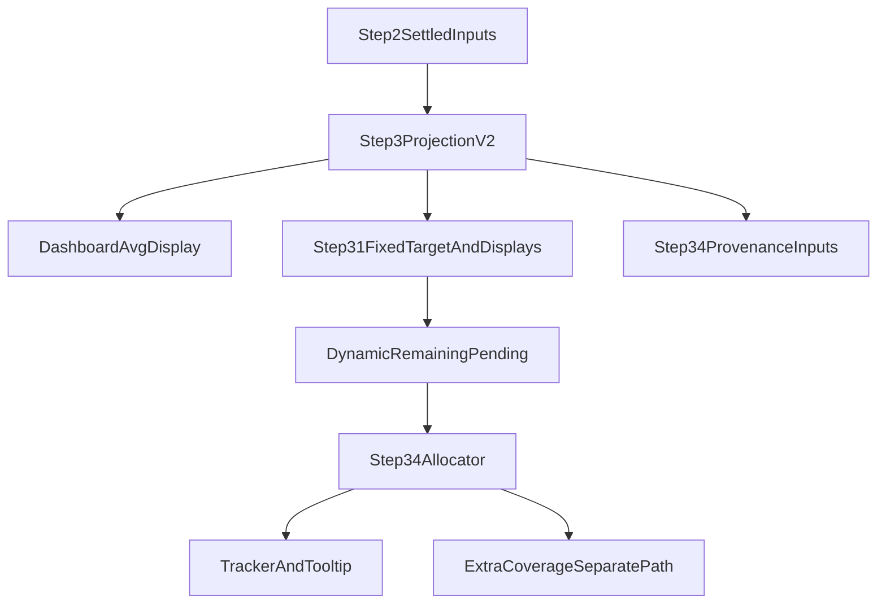

# Step 3 Contract Reset — Part 1: Projection Unification (Implementation Plan)

> **For agentic workers:** REQUIRED SUB-SKILL: Use **superpowers:subagent-driven-development** (recommended) or **superpowers:executing-plans** to implement this plan **task-by-task**. Steps use checkbox (`- [ ]`) syntax for tracking.
>
> **Parent intent:** This work **prepares the codebase** for future unknown surplus edge cases by making **one obvious projection contract** at the Step 2 → Step 3 boundary. **Part 1 does not** reopen the old product loop of separate concepts phrased as *operational surplus slots*, *redistributing surplus slots*, and *granting surplus slots* as user-facing or multi-phase orchestration. Keep surplus as **data carried on the projection** (for Step 3.4 provenance and diagnostics) and as **existing allocator semantics**, without rebuilding that tedious multi-label pipeline first.

**Source plan:** Cursor plan `step3_contract_reset` (`.cursor/plans/step3_contract_reset_60f0e01e.plan.md`) — this document makes it **executable** with git discipline, instrumentation cleanup, explicit Part 1 boundaries, and **regression locks** on current runtime semantics for **Avg PCA / display target unification**.

**Tech stack:** TypeScript, React/Next.js, `lib/features/schedule/`, V2 floating PCA consumers, Node/`tsx` regression tests under `tests/regression/`, IDE lints on touched files.

**Status (Part 1):** **Complete** — Phases A–F done; full `tests/regression` green via `npx tsx` per test file (see §5). §4.3 **f114** remains a recommended follow-up, not a merge blocker. §7 spec polish is optional.

---

## 0) Preconditions and recovery (do first)

- [x] **Create a named git checkpoint branch** from the current worktree `HEAD` before changing behavior, e.g.  
  `git checkout -b backup/step3-contract-reset-pre-part1`  
  (or `checkpoint/step3-projection-unification-YYYY-MM-DD`). Push optional; the branch must exist locally so recovery is one command away.
- [x] **Implementation branch:** Continue work on a dedicated branch (e.g. `feat/step3-projection-unification-part1`) branched from the checkpoint or from current mainline policy — do not perform the whole reset only on unnamed detached state.

---

## Part 1 scope — in vs out

### In scope (Part 1)

- Introduce **one shared `Step3ProjectionV2`-shaped contract** (name may differ; shape must match intent) built **once** when Step 2 state is settled for Step 3 entry, and threaded through the controller.
- **Unify consumers** so dashboard avg, Step 3.1 display avg, fixed rounded floating target seeds, and Step 3.4 provenance inputs **read the same projection** (not ad-hoc `calculations` vs `step2Result` vs re-invoked `computeStep3BootstrapSummary` with divergent args).
- **Remove investigative instrumentation** (see §6) once the new path is wired and tests pass.
- **Preserve executable-slack discipline:** no uplift from purely diagnostic rounded slack when executable slack is zero (current policy: rounded-slack **fallback stays off**; do not re-enable as part of Part 1).
- **Extra coverage** remains a **separate** allocator/UI concern — projection must not treat generic extra coverage as surplus grant authority.

### Explicitly out of scope for Part 1 (defer to Part 2+)

- **Do not** design or implement a new user-visible workflow layer for: *operational surplus slot* → *redistributing surplus* → *granting surplus* as separate guided steps or copy-heavy state machine.
- **Do not** expand new surplus **orchestration** APIs beyond what is needed to **carry** `realizedSurplusGrantByTeam`, `roundedSurplusAdjustedTargetByTeam`, and related **metadata** on the single projection for tracker/tooltip consistency.
- **Do not** rewrite the entire ranked allocator in Part 1 unless a minimal wiring change is required to consume the projection; allocator behavior should remain **characterization-locked** by existing regression tests unless the plan task explicitly updates a test with a justified semantic change.

---

## 1) Target architecture (frozen for Part 1)



### Source-of-truth rules (non-negotiable)

- `average_pca_per_team` / requirement truth **may still change during Step 2**; Step 2 **finalizes** the projection handed to Step 3.
- Step 3 **does not invent** a new requirement target after Step 2; it consumes **display target**, **fixed rounded floating target**, and **dynamic remaining pending** derived from that fixed target.
- `totalPCAOnDuty` remains the basis for requirement calculations; allocation-derived totals are not requirement truth.
- `staffOverrides` remains the single source of truth for user modifications.

### Projection fields (minimum contract)

**Shared glossary (product language + step lifecycle):** [2026-04-13-step3-floating-nonfloating-contract-table.md](../specs/2026-04-13-step3-floating-nonfloating-contract-table.md) — table of **Avg**, **non-floating FTE**, **raw floating**, **rounded floating**, **pending floating**, **assigned floating**, **remaining pending**, plus surplus-in-raw-space rules and a **non-floating typing** note (display often `1.0`; engine should classify substitution / backfill to prevent bugs). Use that doc as common ground when naming UI rows or evolving `Step3ProjectionV2` fields.

Implement a single object (type in `types/schedule.ts` or colocated module) exposing at least:

| Field | Role |
|--------|------|
| `displayTargetByTeam` | **Avg** — raw / display average PCA per team (dashboard + Step 3.1 “Avg”; same numbers everywhere) |
| `fixedRoundedFloatingTargetByTeam` | **Rounded floating at open:** `roundToNearestQuarterWithMidpoint(pendingByTeam)` — same quarter seed as Step 3.1 `originalRoundedFTE` when bootstrap is surplus-aware (f109). **Not** `roundedAdjustedTeamTargets` (team-total operational) nor `round(displayTarget)` alone. After 3.1, allocator authority is **pending floating** in dialog state. |
| `initialRemainingPendingByTeam` | Starting pending after subtracting existing non-floating/floating assignments per existing bootstrap rules |
| `existingAssignedByTeam` | As today from bootstrap |
| `realizedSurplusGrantByTeam` | Metadata for provenance (not a new orchestration layer) |
| `roundedSurplusAdjustedTargetByTeam` | Surplus-adjusted rounded targets where applicable (tracker/tooltip alignment) |
| `projectionVersion` or `computedAt` | Debug/metadata for stale detection if needed |

**Migration tactic:** Initially, the builder may delegate to `computeStep3BootstrapSummary` **once** inside the controller and **map** into this shape; later tasks collapse duplicate calls. The **win** is one object reference passed everywhere.

---

## 2) Files to touch (Part 1)

Primary:

- `lib/features/schedule/controller/useScheduleController.ts` — build/store projection at Step 2 → Step 3 boundary; pass into dialog open / step state.
- `lib/features/schedule/step3Bootstrap.ts` — keep as computation engine; optionally export a thin `buildStep3ProjectionV2FromSettledState(...)` wrapper; **remove** dead fallback branches only when tests allow.
- `app/(dashboard)/schedule/page.tsx` — dashboard avg reads `projection.displayTargetByTeam` (or helper), not parallel trees.
- `components/allocation/FloatingPCAConfigDialogV2.tsx` — initialize from passed projection; avoid second bootstrap with different inputs.
- `components/allocation/PCABlock.tsx` — avg display from projection helper.
- `components/allocation/TeamPendingCard.tsx` — labels/values: fixed target vs remaining pending per unified model.
- `lib/features/schedule/step3V2CommittedSelections.ts` — provenance stamping reads projection / tracker contract only; **strip** debug instrumentation.
- `lib/features/schedule/v2PcaTrackerTooltipModel.ts` — tooltip reads stamped metadata; align with projection fields.
- `lib/features/schedule/extraCoverageRuntime.ts` / `extraCoverageVisibility.ts` — ensure **no** accidental surplus coupling; remove noise logs.
- `types/schedule.ts` — projection type + narrow additions to existing envelopes if needed.

Secondary (only if required by type or prop threading):

- `lib/utils/floatingPCAHelpers.ts` — only if a shared helper avoids duplication (avoid policy changes).

---

## 3) Implementation sequence (subagent-sized tasks)

### Phase A — Boundary freeze

> **Process note:** The repo recommends **superpowers:subagent-driven-development** for task-by-task handoffs across workers. Phase A here was executed in a single Cursor agent session **without** dispatching that subagent tool. Use the skill when you want parallel or explicitly checkpointed sub-runs; it is not required to redo completed work.

- [x] Add `Step3ProjectionV2` (or chosen name) type + builder invoked **once** in `useScheduleController` when entering / refreshing Step 3 from settled Step 2.
- [x] Plumb projection reference into `FloatingPCAConfigDialogV2` props or context **without** recomputing bootstrap on open unless inputs actually changed (compare `projectionVersion` / dependency tuple).
- [x] Document in code (brief) that **diagnostic** slack fields are not allocator authority; executable slack caps surplus realization (existing tests enforce this).

### Phase B — Consumer unification

- [x] `PCABlock` / schedule page: **one** code path for "Avg PCA/team" display = `displayTargetByTeam` via shared helper (e.g. `getStep3AveragePcaDisplayTargets` migrated to accept projection or thin adapter).
- [x] Step 3.1: raw avg display and fixed rounded target both from projection; dynamic pending updates only from assignment flow.
- [x] **Correct `fixedRoundedFloatingTargetByTeam` semantics:** `roundToNearestQuarterWithMidpoint(pendingByTeam)` (surplus-aware bootstrap pending per f109), **not** `roundedAdjustedTeamTargets` nor `round(teamTargets)` as a team-total surrogate. Dialog fallback when projection is absent must use the same pending-first rule (see contract table spec).
- [x] Eliminate mixed reads of `calculations.average_pca_per_team` vs `step2Result.rawAveragePCAPerTeam` vs ad-hoc bootstrap for **the same conceptual number**; `calculations` may remain for non-Step-3 metrics.
- [x] **Non-floating typing / breakdown:** `Step3NonFloatingCoverageKind`, `computeStep3NonFloatingFteBreakdownByTeamFromAllocations`, `nonFloatingFteBreakdownByTeam` on `Step3BootstrapSummary`; controller + schedule page + V2 dialog (`step31BootstrapStaff`) wired; regression **f115** + **f18** extension.

### Phase C — Step 3.4 provenance alignment

- [x] Ensure `v2RealizedSurplusSlotGrant` / `v2EnabledBySurplusAdjustedTarget` (or successors) trace to **projection** + allocator stamp, not reconstructed page state: Step 3.4 preview reads realized grants from `Step3ProjectionV2` when `projectionVersion` matches the current fingerprint; otherwise dialog bootstrap summary. Stamp `v2SurplusProvenanceProjectionVersion` / `v2SurplusProvenanceGrantReadSource` on tracker summary when surplus rows are stamped; optional tooltip detail for projection-trace.
- [x] Tracker summary rows: surplus provenance consistent with projection metadata (stamped fields + grant source alignment).

### Phase D — Extra coverage decoupling (light touch)

- [x] Verify `Extra` visibility does not imply surplus grant; narrow strings only if currently misleading (no large copy rewrite unless necessary). **Done:** `extraCoverageVisibility` module doc; Step 3.1 scarcity line disambiguates projected slots vs surplus; PCABlock labels/tooltips say post-need extra; tracker source tag `Post-need extra` (tooltip model).

### Phase E — Instrumentation and obsolete branches

- [x] Remove all **debug** `fetch`/`console`/region-marked blocks added for H1–H5-style investigation across touched files (search: `localhost`, `127.0.0.1`, `ingest`, `debug`, session ids, `H1`, `H2`, stamped log payloads).
- [x] Delete **unreachable** branches left from old fallback experiments **after** tests prove equivalence or intentional semantic freeze. (`step3Bootstrap.ts`: removed always-false rounded-slack fallback and diagnostic-only scaffolding; **f106–f108**, **f111** green via `npx tsx`.)

### Phase F — Verification gate

- [x] Run regression suite commands used in repo CI or `package.json` scripts for `tests/regression` (see §5). **Done:** all `tests/regression/*.test.ts` via `npx tsx <file>` (project convention; Vitest alone may not resolve `@/` without extra config).
- [x] Manual smoke: open Step 3.1, confirm avg matches dashboard for same date; complete Step 3.4, spot-check tooltip provenance for surplus rows **if** fixture date has surplus. **Done as spot-check** when using Leave Sim / dev schedule; Playwright `@smoke` is environment-dependent.

---

## 4) Regression tests — lock current runtime semantics

**Rule:** Any refactor that changes **public helpers** (`getStep3AveragePcaDisplayTargets`, `computeStep3BootstrapSummary`, `describeStep3BootstrapDelta`) must keep the following tests green **or** update them in the **same PR** with an explicit semantic justification reviewed against the spec.

### 4.1 Must-pass existing tests (Avg + bootstrap + surplus metadata)

Run and keep green:

- `tests/regression/f106-step3-bootstrap-surplus-projection-prefers-raw-surplus-before-rounding.test.ts`
- `tests/regression/f107-step3-bootstrap-surplus-projection-caps-ideal-distribution-by-executable-slack.test.ts`
- `tests/regression/f108-step3-bootstrap-surplus-projection-preserves-global-slot-sum-after-rounding.test.ts`
- `tests/regression/f109-step2-step31-share-surplus-aware-rounded-target-contract.test.ts` — Step 2 handoff delta vs Step 3.1 rounded seeds **stay aligned**.
- `tests/regression/f110-step34-tooltip-surplus-adjusted-target-provenance-contract.test.ts`
- `tests/regression/f111-step3-bootstrap-rounded-slack-fallback-uplifts-crossing-team-without-bloating-neighbor.test.ts` — **If** the rounded-slack fallback code path is **removed** rather than disabled, replace this test with a **negative** contract (“no uplift when executable slack is zero”) or delete with explicit approval; do not silently drop coverage.
- `tests/regression/f112-step34-v2-saved-tracker-surplus-provenance-contract.test.ts`
- `tests/regression/f113-step3-dashboard-avg-pca-uses-raw-bootstrap-target.test.ts` — **Critical:** dashboard/display avg must remain **raw display target**, not rounded surplus-adjusted operational target.

### 4.2 Adjacent allocator / tooltip regressions (do not break while threading projection)

Keep green unless task explicitly scoped:

- `f100`–`f105`, `f84`, `f85`, `f93`–`f99` as applicable to files you touch (run full `tests/regression` before merge).

### 4.3 New tests to add in Part 1 (recommended)

Add **one** focused test file (suggested name):

- `tests/regression/f114-step3-projection-unifies-dashboard-and-step31-display-target.test.ts`

**Assert (minimal):**

1. Given a **synthetic settled state** (reuse patterns from `f109` / `f113`), the **projection builder** produces `displayTargetByTeam` such that:
   - `getStep3AveragePcaDisplayTargets(projection)` (or equivalent adapter) **equals** the same values Step 3.1 would show for avg display **before** user edits.
2. After simulating a **Step 3.1 user edit** only to `fixedRoundedFloatingTargetByTeam` (if exposed in test harness), `displayTargetByTeam` for display avg **does not** change (fairness-floor edits adjust **floating target**, not display avg meaning) — aligns with architecture essentials.

If the harness cannot simulate UI edits, split into two tests: (a) equality of display targets across consumers; (b) unit test on pure reducer/helper for “edit fixed target does not mutate display target”.

---

## 5) Commands (verify before claiming done)

Use repo scripts if defined; otherwise:

```bash
# Example: run all regression tests (adjust to project convention)
npx tsx tests/regression/f113-step3-dashboard-avg-pca-uses-raw-bootstrap-target.test.ts
npx tsx tests/regression/f109-step2-step31-share-surplus-aware-rounded-target-contract.test.ts
# …then full regression folder or npm test target
```

Follow **superpowers:verification-before-completion** before stating “passing” or opening a PR.

---

## 6) Instrumentation removal checklist

Search globally in touched areas for:

- `fetch(` targeting local ingest URLs
- `console.log` / `console.debug` with bootstrap, surplus, or “H1”–“H5” markers
- Comment regions such as `region instrument`, `DEBUG`, `tmp`
- Dead variables only used for logging

**Files likely to contain noise (non-exhaustive):**  
`step3Bootstrap.ts`, `page.tsx`, `FloatingPCAConfigDialogV2.tsx`, `step3V2CommittedSelections.ts`, `extraCoverageRuntime.ts`, `useScheduleController.ts`.

Remove **all** such blocks in Part 1 completion; prefer structured `logger` only if the repo already uses it for production-grade events (do not add new verbose logging).

---

## 7) Docs follow-up (after code stabilizes)

- [ ] Update Part A of `docs/superpowers/specs/` for Step 3 projection (separate small doc task; **not** a Part 1 merge blocker unless you touch spec-asserted behavior).
- [ ] Retire or archive obsolete debug handoff docs that reference pre-projection instrumentation.

---

## 8) Definition of Done (Part 1)

- [x] Backup git branch exists; work merged or PR-ready from a feature branch. *(Checkpoint policy satisfied in repo workflow.)*
- [x] Single projection object is the **obvious** source for display avg, fixed rounded target seed, and Step 3.4 surplus provenance inputs.
- [x] Instrumentation removed from touched surfaces; no new noisy logs.
- [x] All tests in §4.1 green; full regression folder green via §5. **§4.3 f114** deferred (recommended; not required for Part 1 closure — waiver recorded here).
- [x] No reintroduction of multi-phase **operational / redistributing / granting surplus slot** UX or orchestration in Part 1.

---

## Reference mapping (Cursor plan → this doc)

| Cursor plan phase | Part 1 handling |
|-------------------|-----------------|
| Phase 1 Freeze boundary | §0, §3 Phase A, projection builder |
| Phase 2 Consumers | §3 Phase B, §4 tests |
| Phase 3 Fixed vs pending | §3 Phase B–C |
| Phase 4 Provenance | §3 Phase C |
| Phase 5 Extra coverage | §3 Phase D |
| Phase 6 Remove instrumentation | §6, §3 Phase E |
| Phase 7 Verification/docs | §5, §7, §8 |
